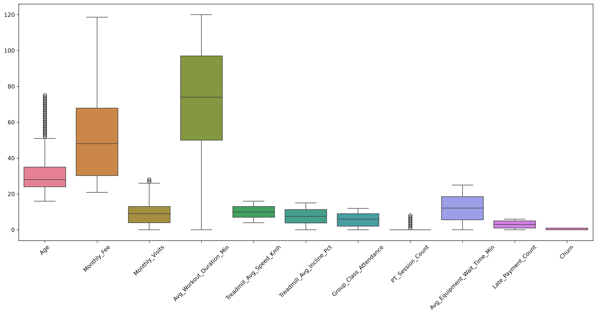
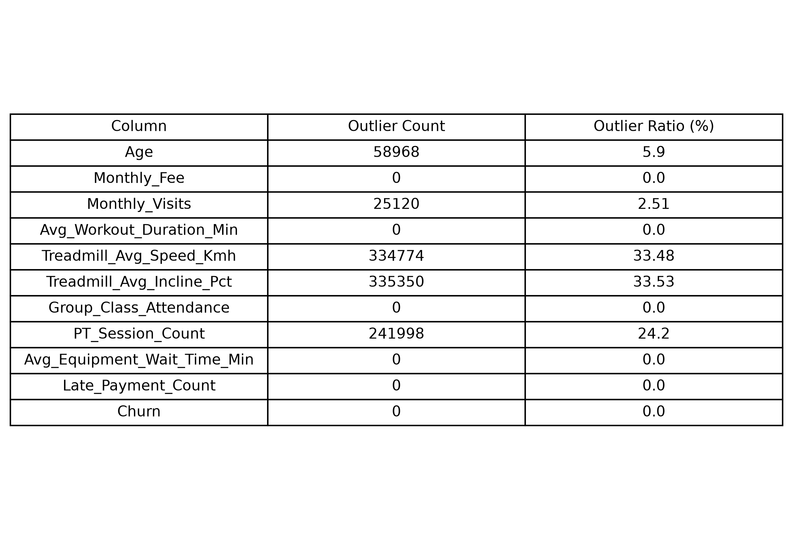
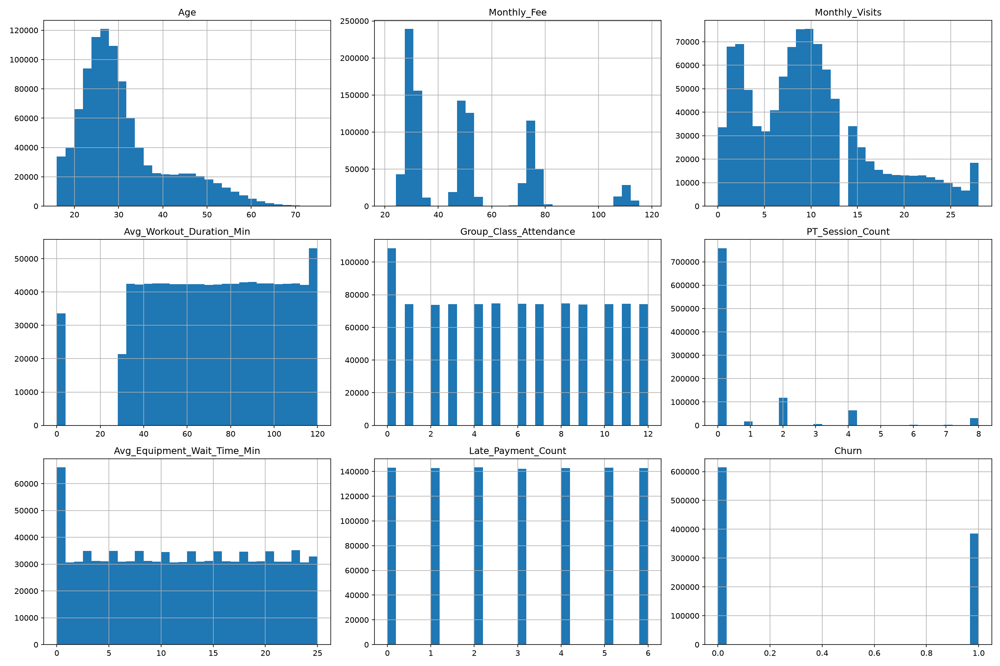
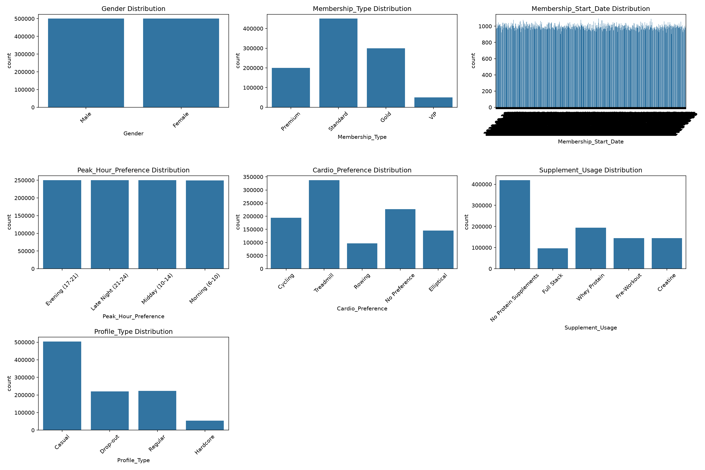
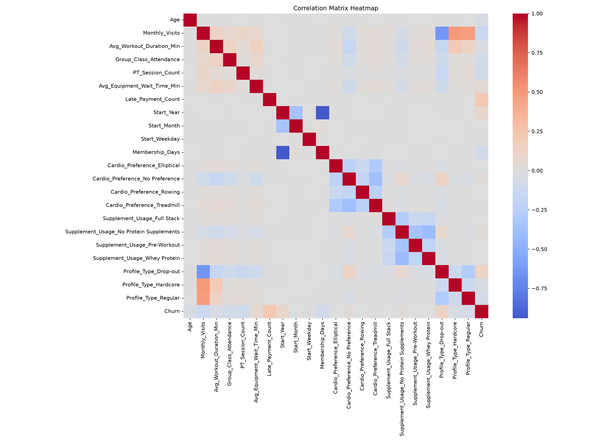

# EDA (Exploratory Data Analysis)

## 1. 데이터셋 정보

- **데이터명** : Synthetic Gym Membership Churn Dataset (1M Rows)
- **출처** : Kaggle (Emin Karlıtepe)
- **데이터 개수** : 1,000,000건 (Rows)
- **컬럼 수** : 19개 (Columns)
- **목표 변수(Target)** : Churn (0: 유지, 1: 이탈)
---

## 2. 컬럼 정보

| 컬럼명                           | 설명                | Type               |
| ----------------------------- | ----------------- |---------------- |
| `Member_ID`                   | 고유 회원 식별자         | int64 |
| `Age`                         | 고객 연령             | int64 |
| `Gender`                      | 성별 범주             | str|
| `Membership_Type`             | 헬스장 회원권 플랜        |str|
| `Membership_Start_Date`       | 멤버십 시작일           |str|
| `Monthly_Fee`                 | 월간 구독료            |float64|
| `Monthly_Visits`              | 월간 방문 횟수          |int64 |
| `Avg_Workout_Duration_Min`    | 평균 운동 시간(분)       |int64 |
| `Peak_Hour_Preference`        | 선호하는 헬스장 이용 시간    |str|
| `Cardio_Preference`           | 선호하는 유산소 운동 기구    |str|
| `Treadmill_Avg_Speed_Kmh`     | 러닝머신 평균 속도(km/h)  |float64|
| `Treadmill_Avg_Incline_Pct`   | 러닝머신 평균 경사도(%)    |float64|
| `Group_Class_Attendance`      | 그룹 수업 참여 횟수       |int64 |
| `PT_Session_Count`            | 개인 트레이너(PT) 세션 횟수 |int64 |
| `Supplement_Usage`            | 보충제 사용 여부/범주      |str|
| `Avg_Equipment_Wait_Time_Min` | 평균 장비 대기 시간(분)    |float64|
| `Late_Payment_Count`          | 연체 건수             |int64|
| `Profile_Type`                | 시뮬레이션된 고객 프로필_    |str|
|`Churn`| 이탈(0/1)|int64|

### 전처리 전 데이터 타입 확인

| Type     | 개수 |
|----------|----|
| int64    | 8  |
| float    | 4  |
| str      | 7  |

---

## 3. 결측치 확인

### 결측치 개수

| 컬럼명 | 결측치    | 처리 방법                          | 처리 이유                           |
|--------|--------|--------------------------------|---------------------------------|
|Cardio_Preference | 226685 | None -> No Preference          | 유산소 운동을 선호 하지 않는 경우를 고려         |
|Treadmill_Avg_Speed_Kmh | 662402 |                    Median            | 연속형 수치 데이터이며 결측치가 많기 때문에 제거 불가능 |
|Treadmill_Avg_Incline_Pct | 662402 |                 Median               |  연속형 수치 데이터이며 결측치가 많기 때문에 제거 불가능          |
|Supplement_Usage | 419573 | None -> No Protein Supplements | 프로틴을 사용하지 않는 경우를 고려             |

---

## 4. 중복 데이터 확인

- **중복 데이터 개수** : 0
- **처리 방법** : 없음
- **처리 이유** : 없음

---

## 5. 이상치 확인

### 확인 방법

- Box Plot

- IQR

### 처리 결과

처리 결과
- Age, Monthly_Visits, PT_Session_Count에서 일부 이상치가 확인되었으나 실제 회원의 다양한 이용 패턴을 반영하는 값으로 판단하여 제거하지 않았다.
---

## 6. 데이터 분포

### 수치형 변수

---

수치형 컬럼 8개(Churn 제외)에 대해 Churn=0(잔존) / Churn=1(이탈) 그룹 간 평균·중앙값·표준편차·최소/최대를 비교하고, Churn과의 피어슨 상관계수를 계산함.

---

## 변수별 상세 결과

### Age

| Churn | 평균 | 중앙값 | 표준편차 | 최소 | 최대 |
|---|---|---|---|---|---|
| 0 | 31.06 | 28.0 | 10.29 | 16 | 75 |
| 1 | 30.33 | 28.0 | 10.27 | 16 | 75 |

- 평균 차이(Churn=1 - Churn=0): **-0.73 (-2.35%)**
- 상관계수: **-0.0344**

### Monthly_Fee

| Churn | 평균 | 중앙값 | 표준편차 | 최소 | 최대 |
|---|---|---|---|---|---|
| 0 | 48.99 | 48.06 | 22.08 | 21.31 | 118.59 |
| 1 | 48.99 | 48.07 | 22.06 | 20.89 | 118.17 |

- 평균 차이(Churn=1 - Churn=0): **0.0 (0.0%)**
- 상관계수: **-0.0001**

### Monthly_Visits

| Churn | 평균 | 중앙값 | 표준편차 | 최소 | 최대 |
|---|---|---|---|---|---|
| 0 | 10.42 | 10.0 | 6.78 | 0 | 28 |
| 1 | 8.70 | 8.0 | 6.60 | 0 | 28 |

- 평균 차이(Churn=1 - Churn=0): **-1.72 (-16.51%)**
- 상관계수: **-0.1237**

### Avg_Workout_Duration_Min

| Churn | 평균 | 중앙값 | 표준편차 | 최소 | 최대 |
|---|---|---|---|---|---|
| 0 | 73.32 | 74.0 | 28.23 | 0 | 120 |
| 1 | 71.17 | 73.0 | 30.49 | 0 | 120 |

- 평균 차이(Churn=1 - Churn=0): **-2.15 (-2.93%)**
- 상관계수: **-0.0359**

### Group_Class_Attendance

| Churn | 평균 | 중앙값 | 표준편차 | 최소 | 최대 |
|---|---|---|---|---|---|
| 0 | 6.04 | 6.0 | 3.81 | 0 | 12 |
| 1 | 5.42 | 5.0 | 3.84 | 0 | 12 |

- 평균 차이(Churn=1 - Churn=0): **-0.62 (-10.26%)**
- 상관계수: **-0.0784**

### PT_Session_Count

| Churn | 평균 | 중앙값 | 표준편차 | 최소 | 최대 |
|---|---|---|---|---|---|
| 0 | 0.94 | 0.0 | 1.93 | 0 | 8 |
| 1 | 0.60 | 0.0 | 1.45 | 0 | 8 |

- 평균 차이(Churn=1 - Churn=0): **-0.34 (-36.17%)**
- 상관계수: **-0.0942**

### Avg_Equipment_Wait_Time_Min

| Churn | 평균 | 중앙값 | 표준편차 | 최소 | 최대 |
|---|---|---|---|---|---|
| 0 | 11.78 | 11.6 | 7.21 | 0.0 | 25.0 |
| 1 | 12.58 | 12.9 | 7.77 | 0.0 | 25.0 |

- 평균 차이(Churn=1 - Churn=0): **+0.8 (+6.79%)**
- 상관계수: **+0.0526**

### Late_Payment_Count

| Churn | 평균 | 중앙값 | 표준편차 | 최소 | 최대 |
|---|---|---|---|---|---|
| 0 | 2.64 | 2.0 | 1.96 | 0 | 6 |
| 1 | 3.57 | 4.0 | 1.93 | 0 | 6 |

- 평균 차이(Churn=1 - Churn=0): **+0.93 (+35.23%)**
- 상관계수: **+0.2245**

---

## 상관계수 기준 정렬 (절댓값 기준 내림차순)

| 순위 | 변수 | 상관계수 | 방향 | 해석 |
|---|---|---|---|---|
| 1 | Late_Payment_Count | +0.2245 | 양(+) | 연체 많을수록 이탈 ↑ |
| 2 | Monthly_Visits | -0.1237 | 음(-) | 방문 빈도 낮을수록 이탈 ↑ |
| 3 | PT_Session_Count | -0.0942 | 음(-) | PT 세션 적을수록 이탈 ↑ |
| 4 | Group_Class_Attendance | -0.0784 | 음(-) | 그룹 클래스 참석 적을수록 이탈 ↑ |
| 5 | Avg_Equipment_Wait_Time_Min | +0.0526 | 양(+) | 대기시간 길수록 이탈 ↑ (약함) |
| 6 | Avg_Workout_Duration_Min | -0.0359 | 음(-) | 운동시간 짧을수록 이탈 ↑ (약함) |
| 7 | Age | -0.0344 | 음(-) | 나이 적을수록 이탈 ↑ (거의 무관) |
| 8 | Monthly_Fee | -0.0001 | 무관 | 요금과 이탈은 사실상 무관계 |

---

## 인사이트

1. **Late_Payment_Count(연체 횟수)가 수치형 변수 중 가장 강한 상관관계(+0.2245)를 보임.** Churn=1 그룹의 연체 횟수 평균이 Churn=0 대비 35.23% 높음(2.64건 → 3.57건). 결제 실패/연체가 이탈의 선행 신호일 가능성이 높음.
2. **참여도 지표(Monthly_Visits, PT_Session_Count, Group_Class_Attendance)가 일관되게 음의 상관관계**를 보이며, 이는 앞서 범주형 분석(Cardio_Preference의 "No Preference", Supplement_Usage의 "No Protein" 그룹이 이탈률 최고)과 동일한 방향의 패턴. **"관여도가 낮을수록 이탈 확률이 높다"는 결론이 수치형·범주형 양쪽에서 일관되게 재확인됨.**
   - Monthly_Visits: 상관계수 -0.1237로 수치형 변수 중 2위, 평균 차이 -16.51%
   - PT_Session_Count: 평균 차이가 가장 큰 비율(-36.17%)을 보이지만 절대값(0.94 → 0.60)이 작아 상관계수 자체는 -0.0942로 중간 수준
3. **Monthly_Fee는 Churn과 사실상 무관.** 특히 Monthly_Fee는 상관계수 -0.0001로 완전한 무관계 → 가격(요금) 자체는 이탈의 원인이 아님. 이는 앞선 범주형 분석에서 Membership_Type(요금제 등급)이 이탈률에 영향을 주지 않았던 것과 일치하는 결과 — 
4. **Avg_Equipment_Wait_Time_Min은 유일하게 "불편함 지표"로서 양의 상관관계(+0.0526)**를 보임. 대기시간이 길수록 이탈 확률이 소폭 증가하는 경향이나, 상관계수 자체는 약한 수준.
전체적으로 **모든 수치형 변수의 상관계수가 절댓값 0.22 이하로 약한 편** → 단일 수치형 변수만으로는 이탈을 설명하기 어렵고, Late_Payment_Count와 참여도 지표들을 결합한 다변량 모델(로지스틱 회귀, 트리 기반 모델 등)이 필요함을 시사.

---

## 범주형 분석과의 통합 관전 포인트

- 범주형에서 가장 강력했던 변수: **Profile_Type** (Drop-out 49.66% vs Hardcore 30.33%, 격차 19.33%p)
- 수치형에서 가장 강력했던 변수: **Late_Payment_Count** (상관계수 +0.2245)
- 두 변수 모두 "행동/이력 기반" 변수라는 공통점이 있으며, 인구통계/요금제 계열 변수(Gender, Membership_Type, Age, Monthly_Fee)는 범주형·수치형 가리지 않고 이탈에 거의 영향이 없다는 점이 전체 데이터셋의 핵심 패턴으로 재확인됨.
- 다음 단계로는 Profile_Type과 Late_Payment_Count 두 강력 변수 간의 상호작용(예: Profile_Type별 Late_Payment_Count 분포 비교) 확인.

### 범주형 변수

---

**범주형 컬럼 (7개)**

| 컬럼명 | 고유값 개수 |
|---|---|
| Gender | 2 |
| Membership_Type | 4 |
| Membership_Start_Date | 1,005 |
| Peak_Hour_Preference | 4 |
| Cardio_Preference | 5 |
| Supplement_Usage | 5 |
| Profile_Type | 4 |

---

## 범주형 컬럼별 분포

### Gender

| 값 | 개수 |
|---|---|
| Female | 500,002 |
| Male | 499,998 |

- 사실상 정확히 50:50 → 인위적으로 생성된 균형 분포일 가능성 존재

### Membership_Type

| 값 | 개수 |
|---|---|
| Standard | 449,978 |
| Gold | 299,987 |
| Premium | 200,370 |
| VIP | 49,665 |

- 등급이 올라갈수록 인원이 정확히 감소하는 피라미드형 구조 (45% → 30% → 20% → 5%)

### Membership_Start_Date

- 고유값 1,005개 (날짜)
- 최다: 2024-02-03 (1,093건)
- 최소권: 2025-01-24 (904건)
- 날짜별 편차가 904~1,093건으로 매우 고름 → 계절성(신년 다짐, 여름 시즌 등) 없이 균등 분포로 합성 데이터일 확률이 있으며 변별력이 떨어짐

### Peak_Hour_Preference

| 값 | 개수 |
|---|---|
| Midday (10-14) | 250,332 |
| Late Night (21-24) | 250,218 |
| Evening (17-21) | 249,851 |
| Morning (6-10) | 249,599 |

- 4개 구간이 거의 정확히 25%씩 분포

### Cardio_Preference

| 값 | 개수 |
|---|---|
| Treadmill | 337,598 |
| No Preference | 226,685 |
| Cycling | 193,756 |
| Elliptical | 145,220 |
| Rowing | 96,741 |

- Treadmill이 34%로 압도적 1위, Rowing이 10%로 최저 → 실제 헬스장 트렌드와 부합하는 불균형 분포

### Supplement_Usage

| 값 | 개수 |
|---|---|
| No Protein Supplements | 419,573 |
| Whey Protein | 193,827 |
| Pre-Workout | 145,301 |
| Creatine | 144,605 |
| Full Stack | 96,694 |

### Profile_Type

| 값 | 개수 |
|---|---|
| Casual | 503,759 |
| Regular | 222,581 |
| Drop-out | 220,021 |
| Hardcore | 53,639 |

- Casual 50%, Regular·Drop-out 각 22%, Hardcore 5%

---

## Churn 교차분석 (범주형 변수별 이탈률)

### Gender

| Gender | 전체 인원 | 이탈률 |
|---|---|---|
| Female | 500,002 | 38.69% |
| Male | 499,998 | 38.45% |

### Membership_Type

| Membership_Type | 전체 인원 | 이탈률 |
|---|---|---|
| Standard | 449,978 | 38.54% |
| Gold | 299,987 | 38.65% |
| Premium | 200,370 | 38.53% |
| VIP | 49,665 | 38.51% |

### Peak_Hour_Preference

| Peak_Hour_Preference | 전체 인원 | 이탈률 |
|---|---|---|
| Midday (10-14) | 250,332 | 38.67% |
| Late Night (21-24) | 250,218 | 38.55% |
| Evening (17-21) | 249,851 | 38.58% |
| Morning (6-10) | 249,599 | 38.49% |

### Cardio_Preference

| Cardio_Preference | 전체 인원 | 이탈률 |
|---|---|---|
| Treadmill | 337,598 | 37.93% |
| No Preference | 226,685 | 40.79% |
| Cycling | 193,756 | 38.06% |
| Elliptical | 145,220 | 37.89% |
| Rowing | 96,741 | 37.66% |

### Supplement_Usage

| Supplement_Usage | 전체 인원 | 이탈률 |
|---|---|---|
| No Protein Supplements | 419,573 | 39.57% |
| Whey Protein | 193,827 | 37.96% |
| Pre-Workout | 145,301 | 37.81% |
| Creatine | 144,605 | 37.69% |
| Full Stack | 96,694 | 37.94% |

### Profile_Type

| Profile_Type | 전체 인원 | 이탈률 |
|---|---|---|
| Casual | 503,759 | 37.11% |
| Regular | 222,581 | 32.90% |
| Drop-out | 220,021 | 49.66% |
| Hardcore | 53,639 | 30.33% |

---

## 변수별 Churn 영향력 정리

### 영향 거의 없음 (기준선 38.5% ±0.3%p 이내)

- **Gender**: 38.45% ~ 38.69% (차이 0.24%p)
- **Membership_Type**: 38.51% ~ 38.65% (차이 0.14%p)
- **Peak_Hour_Preference**: 38.49% ~ 38.67% (차이 0.18%p)

공통점: 세 변수 모두 분포 자체가 균형/피라미드형으로 규칙적으로 나뉜 변수. 분포가 인위적으로 균등하게 생성된 변수일수록 Churn과의 관계도 평평하게 나타남.

### 약한 영향 (1~3%p 차이)

- **Cardio_Preference**: 최고 No Preference(40.79%) ↔ 최저 Rowing(37.66%), 차이 3.13%p
- **Supplement_Usage**: 최고 No Protein(39.57%) ↔ 최저 Creatine(37.69%), 차이 1.88%p

공통 패턴: "운동 종류 무관심" / "보충제 미섭취" 그룹이 이탈률 최고점 → 운동에 대한 관여도가 낮을수록 이탈 경향 증가

### 강한 영향 (Profile_Type, 최대 19.33%p 차이)

- Drop-out: 49.66% (기준선 대비 +11.16%p, 전체 중 최고)
- Casual: 37.11% (기준선 대비 -1.39%p)
- Regular: 32.90% (기준선 대비 -5.60%p)
- Hardcore: 30.33% (기준선 대비 -8.17%p, 전체 중 최저)
- Drop-out ↔ Hardcore 격차: **19.33%p**

---

## 교차 인사이트

1. **분포가 정확히 균등한 변수(Gender 50:50, Peak_Hour 25%×4)일수록 이탈률도 균등** → 무작위 배정 변수라는 신호로 해석 가능.
2. **분포의 불균형 여부와 이탈률 영향력은 별개.** Membership_Type은 분포가 45→30→20→5로 불균형하지만 이탈률엔 영향 없음. 반면 Cardio_Preference, Supplement_Usage, Profile_Type은 불균형하면서 실제 이탈률 차이도 만듦.
3. **Membership_Start_Date의 날짜별 분포가 지나치게 고름(계절성 없음)** → 실제 헬스장 데이터라면 나타날 법한 신년/여름 성수기 패턴이 부재. Gender, Peak_Hour와 함께 합성 데이터(synthetic data) 가능성을 시사하는 근거.
4. **"관여도(engagement)"가 이탈의 핵심 축으로 보임.** Cardio_Preference의 "No Preference", Supplement_Usage의 "No Protein"처럼 무관심/미참여 그룹이 이탈률 최고점을 기록하는 동일한 패턴이 반복됨. Profile_Type의 Hardcore(최저 이탈)와 Drop-out(최고 이탈) 구도도 같은 맥락.
5. **Profile_Type의 "Drop-out" 범주는 이탈률 49.66%로 다른 범주(Casual 37.11%, Regular 32.90%, Hardcore 30.33%) 대비 압도적으로 높게 나타나, 변수명 자체가 결과를 암시하는 타겟 누수 가능성을 검토함. 다만 Drop-out 그룹의 실제 이탈률이 49.66%로 100%가 아니라 절반 수준에 그치는 점으로 보아 Churn과 완전히 1:1로 매핑되는 완전 누수는 아닌 것으로 판단됨. 이에 따라 Profile_Type은 삭제하지 않고 분석 및 모델링에 그대로 사용하기로 결정함.

---

## 미해결 / 다음 단계

아래는 아직 계산하지 않은 항목이며, 가설 단계임을 명시.

- **수치형 컬럼(Age, Monthly_Fee, Monthly_Visits, Avg_Workout_Duration_Min, Group_Class_Attendance, PT_Session_Count, Avg_Equipment_Wait_Time_Min, Late_Payment_Count)과 Churn의 관계 미검증**
  - 가설: Monthly_Visits, Avg_Workout_Duration_Min, Group_Class_Attendance, PT_Session_Count 등 "참여도 지표"는 이탈과 음의 상관관계를 가질 가능성 (Cardio_Preference/Supplement_Usage 패턴과 유사)
  - 가설: Late_Payment_Count는 이탈과 양의 상관관계를 가질 가능성 (연체 많을수록 이탈 많음)
- **Membership_Start_Date 기반 파생변수(가입 연차, 가입 요일 등)와 Churn의 관계 미검증**

---

## 7. 데이터 전처리

### 7.1 결측치 처리

| 컬럼명 | 처리 방법 | 처리 이유 |
|--------|----------|-----------|
| Cardio_Preference | 결측값을 "No Preference"로 대체 | 유산소 운동을 선호하지 않는 회원으로 간주 |
| Supplement_Usage | 결측값을 "No Protein Supplements"로 대체 | 보충제를 사용하지 않는 회원으로 간주 |

### 7.2 이상치 처리

| 컬럼명 | 처리 방법 | 처리 이유 |
|-----|-------|-----------|
| 없음  | 없음    | Age, Monthly_Visits, PT_Session_Count에서 일부 이상치가 확인되었으나 실제 회원의 다양한 이용 패턴을 반영하는 값으로 판단하여 제거하지 않았다.|

### 7.3 컬럼 삭제

| 컬럼명 | 삭제 이유 |
|--------|-----------|
| Member_ID | 고유번호(식별자)로 분석적 의미 없어 제거 |
| Treadmill_Avg_Speed_Kmh | 결측치 2/3 이상 |
| Treadmill_Avg_Incline_Pct | 결측치 2/3 이상 |
| Gender | 분포가 균형(50:50)하며 Churn과의 관계도 평평(차이 0.24%p)하여 제거 |
| Membership_Type | 분포가 피라미드형으로 규칙적이며 Churn과의 관계도 평평(차이 0.14%p)하여 제거 |
| Peak_Hour_Preference | 분포가 균형(25%×4)하며 Churn과의 관계도 평평(차이 0.18%p)하여 제거 |
| Monthly_Fee | Churn과 상관계수 -0.0001로 사실상 무관계이므로 제거 |

### 7.4 feature 엔지니어링

| 컬럼명 | 처리 방법                           | 처리 이유                                            |
|--------|---------------------------------|--------------------------------------------------|
|`Membership_Start_Date` | 파생변수 생성(연/월/요일/가입일수) 및 본 데이터 제거 | str 형태로 저장되어 있어 날짜 연산 불가 및 파생 변수 생성 후 str 데이터 제거 |

### 7.5 인코딩

| 컬럼명 | 인코딩 방법 | 선택 이유 |
|--------|------------|-----------|
| `Cardio_Preference` | One-Hot Encoding | 순서 없는 명목형, 고유값 5개로 카디널리티 낮음 |
| `Supplement_Usage` | One-Hot Encoding | 순서 없는 명목형, 고유값 5개로 카디널리티 낮음 |
| `Profile_Type` | One-Hot Encoding | 순서 없는 명목형, 고유값 4개로 카디널리티 낮음  |

### 7.6 스케일링

| 컬럼명 | 스케일링 방법 | 선택 이유 |
|--------|--------------|-----------|
| `Age` | StandardScaler | 정규분포에 가까운 분포, 이상치 적음 |
| `Monthly_Visits` | StandardScaler | 분포가 고르고 이상치 적음 |
| `Avg_Workout_Duration_Min` | StandardScaler | 0~120 범위의 연속형, 분포 고름 |
| `Treadmill_Avg_Speed_Kmh` | StandardScaler | 중앙값 대체로 값 범위 자체는 안정적 |
| `Treadmill_Avg_Incline_Pct` | StandardScaler | 중앙값 대체로 값 범위 자체는 안정적 |
| `Group_Class_Attendance` | StandardScaler | 0~12 범위, 분포 고름 |
| `PT_Session_Count` | RobustScaler | 0에 몰린 왜도 큰 분포 → 이상치에 강건한 스케일링 필요 |
| `Avg_Equipment_Wait_Time_Min` | StandardScaler | 연속형이며 분포 고름 |
| `Late_Payment_Count` | RobustScaler | Churn과 상관 가장 높은 변수, 분포가 한쪽에 치우침 → 이상치에 강건한 스케일링 필요 |

> One-Hot Encoding으로 생성된 `Cardio_Preference_*`, `Supplement_Usage_*`, `Profile_Type_*` 더미 컬럼(0/1)과 타겟 `Churn`은 스케일링 대상에서 제외.

### 7.7 Feature Selection

| Feature | 선택 여부 | 선택 이유 |
|----------|----------|-----------|
| `Member_ID` | 제외 | 고유 식별자로 분석적 의미 없음 |
| `Age` | 포함 | Churn과 약한 상관(-0.0344)이나 도메인상 의미 있어 유지, 스케일링 후 사용 |
| `Gender` | 제외 | 분포 균형(50:50), Churn과 관계 평평하여 변별력 없음 |
| `Membership_Type` | 제외 | 분포 피라미드형으로 규칙적, Churn과 관계 평평하여 변별력 없음 |
| `Membership_Start_Date` | 제외(파생변수로 대체) | 원본 날짜는 카디널리티 과다, Start_Year/Start_Month/Start_Weekday/Membership_Days로 대체 |
| `Monthly_Fee` | 제외 | Churn과 상관계수 -0.0001로 사실상 무관계 |
| `Monthly_Visits` | 포함 | Churn과 상관계수 -0.1237로 수치형 중 2위, 참여도 지표로서 의미 있음 |
| `Avg_Workout_Duration_Min` | 포함 | 약한 음의 상관(-0.0359)이나 참여도 지표로서 유지 |
| `Peak_Hour_Preference` | 제외 | 분포 균형(25%×4), Churn과 관계 평평하여 변별력 없음 |
| `Cardio_Preference` | 포함 (One-Hot 인코딩) | "No Preference" 그룹 이탈률 최고(40.79%), 관여도 지표로 유의미 |
| `Treadmill_Avg_Speed_Kmh` | 포함 (결측치 중앙값 대체 후 스케일링) | 결측 비율 높으나 삭제보다 대체로 정보 보존 |
| `Treadmill_Avg_Incline_Pct` | 포함 (결측치 중앙값 대체 후 스케일링) | 결측 비율 높으나 삭제보다 대체로 정보 보존 |
| `Group_Class_Attendance` | 포함 | Churn과 상관계수 -0.0784, 참여도 지표로서 의미 있음 |
| `PT_Session_Count` | 포함 | Churn과 상관계수 -0.0942, 참여도 지표 중 상관 높은 편 |
| `Supplement_Usage` | 포함 (One-Hot 인코딩) | "No Protein" 그룹 이탈률 최고(39.57%), 관여도 지표로 유의미 |
| `Avg_Equipment_Wait_Time_Min` | 포함 | Churn과 상관계수 +0.0526, 불편함 지표로서 유의미 |
| `Late_Payment_Count` | 포함 | Churn과 상관계수 +0.2245로 수치형 중 가장 강한 상관관계 |
| `Profile_Type` | 포함 (One-Hot 인코딩, 단 타겟 누수 검증 필요) | 이탈률 격차 최대 19.33%p로 가장 강력한 변수, 단 leakage 의심되어 검증 후 최종 포함 여부 재확인 |
| `Churn` | 타겟 (Feature 아님) | 예측 대상 변수 |

## 8. 상관관계 분석

### 분석 방법

- Correlation Matrix
- Heatmap

---

---

### 주요 결과

| 변수명 | Churn과의 상관계수 |
|-------|-|
| Late_Payment_Count | 0.2245 |
| Monthly_Visits |  -0.1237 |
| Profile_Type_Drop-out | 0.1210 |
| PT_Session_Count | -0.0942 |
| Membership_Days | -0.0899 |
| Start_Year | 0.0839 |
| Group_Class_Attendance | -0.0784 |
| Profile_Type_Regular | -0.0624 |
| Avg_Equipment_Wait_Time_Min | 0.0526 |
| Profile_Type_Hardcore | -0.0403 |
| Avg_Workout_Duration_Min | -0.0359 |
| Age  | -0.0344 |
| Cardio_Preference_No Preference | 0.0247 |
| Supplement_Usage_No Protein Supplements | 0.0174 |
| Cardio_Preference_Treadmill | -0.0094 |
| Supplement_Usage_Pre-Workout | -0.0064 |
| Supplement_Usage_Whey Protein | -0.0062 |
| Cardio_Preference_Rowing | -0.0062 |
| Cardio_Preference_Elliptical | -0.0058 |
| Supplement_Usage_Full Stack | -0.0043 |
| Start_Weekday | 0.0008 |
| Start_Month  | -0.0005 |

### 분석

1. **Late_Payment_Count(연체 건수)가 전체 변수 중 Churn과 가장 강한 상관관계(0.2245)를 보임.** 연체가 많을수록 이탈 확률이 높아지는 경향이 뚜렷하며, 이는 이전 수치형 분석 결과와 일치.

2. **Monthly_Visits(-0.1237), PT_Session_Count(-0.0942), Group_Class_Attendance(-0.0784)가 모두 음의 상관관계로 일관됨.** 방문 빈도, PT 세션, 그룹 클래스 참여가 적을수록 이탈 확률이 높아지는 패턴으로, "관여도가 낮을수록 이탈한다"는 기존 가설을 재확인.

3. **Profile_Type_Drop-out(0.1210)이 One-Hot 변수 중 가장 강한 상관관계를 보이며, 전체 변수 중에서도 3위.** 반대로 Profile_Type_Regular(-0.0624), Profile_Type_Hardcore(-0.0403)는 음의 상관관계를 보여, Drop-out 프로필과 나머지 프로필 간 이탈 방향이 뚜렷하게 갈림. 다만 이전에 언급한 대로 이 변수는 타겟 누수 가능성이 있어 해석에 주의 필요.

4. **Membership_Days(-0.0899)와 Start_Year(0.0839)는 서로 반대 방향이지만 사실상 같은 정보(가입 시점)를 담고 있음.** 가입한 지 오래된 회원(Membership_Days 큼)일수록 이탈 확률이 낮고, 최근에 가입한 회원(Start_Year 큼)일수록 이탈 확률이 높은 경향 → 신규 회원의 초기 이탈(온보딩 실패) 가능성을 시사.

5. **Avg_Equipment_Wait_Time_Min(0.0526)은 유일하게 "불편함" 계열 지표로서 양의 상관관계를 보임.** 대기시간이 길수록 이탈 확률이 소폭 증가.

6. **Cardio_Preference, Supplement_Usage 계열 One-Hot 변수들은 대부분 상관계수 절댓값 0.03 미만으로 매우 약함.** 앞선 groupby 분석에서는 "No Preference", "No Protein" 그룹의 이탈률이 다소 높게 나왔지만, 전체 상관관계 매트릭스 기준으로는 예측력이 크지 않은 보조 변수 수준.

7. **Start_Weekday(0.0008), Start_Month(-0.0005)는 사실상 Churn과 무관.** 가입 요일이나 월은 이탈에 영향을 주지 않는 것으로 확인됨 → 추후 모델링 시 우선순위에서 제외하거나 sin/cos 변환 없이 단순

---

## 9. 타겟 변수 분석

### 클래스 분포

| Churn | 인원 수 | 비율 |
|---|---|---|
| 0 (잔존) | 614,298 | 61.43% |
| 1 (이탈) | 385,702 | 38.57% |

### 클래스 불균형 여부

- 클래스 불균형 비율(다수:소수) = **1.59 : 1**
- 이탈률이 38.57%로 낮지 않은 편이며, 다수/소수 클래스 비율이 약 1.6배 수준으로 **극단적인 불균형은 아님**
- 일반적으로 5:1 이상부터 심각한 불균형으로 간주하는 기준에 비춰보면, 지금 데이터는 **경미한 불균형** 수준
- SMOTE 같은 오버샘플링 없이도 학습이 가능한 수준이나, 모델 성능 평가 시 Accuracy보다는 **F1-score, Recall, ROC-AUC** 등 불균형에 덜 민감한 지표를 우선 사용 권장
- 필요시 `class_weight="balanced"` 옵션(Logistic Regression, XGBoost의 `scale_pos_weight`) 정도로 간단히 보정하는 것으로 충분할 것으로 판단됨

---

### 10 데이터 분할

## Feature Importance

### 주요 영향 변수 Top 15

| 순위 | Feature | Importance |
|---|---|---:|
| 1 | Late_Payment_Count | 0.5128 |
| 2 | Monthly_Visits | 0.1108 |
| 3 | PT_Session_Count | 0.0798 |
| 4 | Start_Year | 0.0781 |
| 5 | Membership_Days | 0.0364 |
| 6 | Group_Class_Attendance | 0.0362 |
| 7 | Avg_Equipment_Wait_Time_Min | 0.0347 |
| 8 | Age | 0.0201 |
| 9 | Supplement_Usage_No Protein Supplements | 0.0074 |
| 10 | Cardio_Preference_Rowing | 0.0074 |
| 11 | Avg_Workout_Duration_Min | 0.0073 |
| 12 | Supplement_Usage_Pre-Workout | 0.0071 |
| 13 | Supplement_Usage_Full Stack | 0.0070 |
| 14 | Cardio_Preference_No Preference | 0.0069 |
| 15 | Start_Month | 0.0069 |

### 주요 인사이트

- **Late_Payment_Count**가 0.5128로 가장 높은 중요도를 기록하여, 회원 이탈 예측에서 결제 연체 이력이 가장 중요한 변수로 확인되었다.
- **Monthly_Visits**와 **PT_Session_Count**는 회원의 이용 빈도와 참여도를 나타내며, 활동성이 낮은 회원일수록 이탈 가능성이 증가하는 패턴을 보였다.
- **Start_Year, Membership_Days**는 가입 시점과 이용 기간에 따른 회원 유지 패턴을 반영하는 변수로 확인되었다.
- **Group_Class_Attendance, Avg_Equipment_Wait_Time_Min**은 헬스장 이용 경험 및 만족도와 관련된 변수로 이탈 예측에 영향을 주었다.
- 운동 선호도 및 보충제 사용 여부와 같은 범주형 변수는 개별 중요도는 낮지만 회원 특성을 구분하는 보조 변수로 활용되었다.

### 결론

Feature Importance 분석 결과, 회원 이탈은 단순한 운동 선호도보다 **결제 행동(Late_Payment_Count), 이용 빈도(Monthly_Visits), 운동 참여도(PT_Session_Count, Group_Class_Attendance), 가입 기간(Membership_Days)**과 같은 행동 기반 변수가 주요 영향을 미치는 것으로 확인되었다.

따라서 이탈 방지를 위해 연체 발생 회원 및 방문 빈도가 감소한 회원을 대상으로 선제적인 리텐션 전략을 적용하는 것이 효과적이다.

---

## 11. 최종 데이터셋

| 컬럼명 | 설명 | Type            |
|--------|------|-----------------|
| `Age` | 고객 연령 | int64           |
| `Monthly_Visits` | 월간 방문 횟수 | int64           |
| `Avg_Workout_Duration_Min` | 평균 운동 시간(분) | int64           |
| `Treadmill_Avg_Speed_Kmh` | 러닝머신 평균 속도(km/h), 결측치 중앙값 대체 | float64         |
| `Treadmill_Avg_Incline_Pct` | 러닝머신 평균 경사도(%), 결측치 중앙값 대체 | float64         |
| `Group_Class_Attendance` | 그룹 수업 참여 횟수 | int64           |
| `PT_Session_Count` | 개인 트레이너(PT) 세션 횟수 | int64           |
| `Avg_Equipment_Wait_Time_Min` | 평균 장비 대기 시간(분) | float64         |
| `Late_Payment_Count` | 연체 건수 | int64           |
| `Start_Year` | 멤버십 시작 연도 (Membership_Start_Date 파생) | int32           |
| `Start_Month` | 멤버십 시작 월 (Membership_Start_Date 파생) | int32           |
| `Start_Weekday` | 멤버십 시작 요일, 0(월)~6(일) (Membership_Start_Date 파생) | int32 |
| `Membership_Days` | 기준일 대비 가입 경과 일수 (Membership_Start_Date 파생) | int64           |
| `Cardio_Preference_*` | 선호 유산소 운동 기구, One-Hot 인코딩 (drop_first) | uint8 / bool    |
| `Supplement_Usage_*` | 보충제 사용 여부, One-Hot 인코딩 (drop_first) | uint8 / bool    |
| `Profile_Type_*` | 고객 프로필 유형, One-Hot 인코딩 (drop_first) | uint8 / bool    |
| `Churn` | 이탈(0/1), 타겟 변수 | int64           |

| Type     | 개수 |
|----------|----|
| int64    | 2  |
| int32    | 3  |
| float64  | 7  |
| bool     | 11 |

| 항목 | 값         |
|------|-----------|
| 샘플 수 | 1,000,000 |
| 컬럼 수 | 23        |

---

## 12. 저장 파일

| 파일명 | 설명 |
|--------|------|
| `churn_100.csv` | 전체 데이터 |
| `churn_50.csv` | 50% 데이터 |

---

## 13. 결론

### 주요 데이터 특징

- 총 100만 행, 16개 컬럼(수치형 9 + 범주형 7), 결측치는 Treadmill 관련 2개 컬럼을 제외하면 없음
- 전체 이탈률은 38.57%로, 클래스 불균형은 경미한 수준(1.59:1)
- 인구통계·요금제 계열 변수(Gender, Membership_Type, Peak_Hour_Preference, Monthly_Fee, Age)는 Churn과 거의 무관 → 균등하게 생성된 변수일수록 이탈률도 균등하게 나타나는 패턴 확인
- 행동/이력 기반 변수(Late_Payment_Count, Monthly_Visits, Profile_Type, PT_Session_Count, Group_Class_Attendance)가 Churn과 상대적으로 강한 상관관계를 보임 → "관여도가 낮을수록, 연체가 많을수록 이탈 확률이 높다"는 일관된 패턴이 범주형·수치형 분석 모두에서 재확인됨
- Profile_Type_Drop-out은 상관관계가 가장 강한 변수 중 하나이나, 카테고리명 자체가 결과를 암시하고 있어 타겟 누수 가능성이 의심됨

### 수행한 전처리 요약

1. **컬럼 삭제**: Member_ID, Gender, Membership_Type, Peak_Hour_Preference, Monthly_Fee, Treadmill_Avg_Speed_Kmh/Incline_Pct(대체 후 유지 또는 삭제 검토)
2. **결측치 처리**: Cardio_Preference·Supplement_Usage는 결측값을 "선호 없음/미사용" 범주로 대체, Treadmill 관련 2개 컬럼은 중앙값 대체
3. **파생변수 생성**: Membership_Start_Date → Start_Year, Start_Month, Start_Weekday(숫자형), Membership_Days로 분리 후 원본 삭제
4. **인코딩**: Cardio_Preference, Supplement_Usage, Profile_Type → One-Hot Encoding(drop_first=True)
5. **스케일링**: 연속형 변수는 StandardScaler, 왜도 큰 변수(PT_Session_Count, Late_Payment_Count)는 RobustScaler 적용
6. **Feature Selection**: XGBoost Feature Importance 기준 상위 50% 변수만 최종 선택

### 전처리 이유

- 분포가 균등하거나 Churn과 상관관계가 거의 없는 변수는 모델 학습에 노이즈로 작용할 수 있어 사전 제거
- 날짜형 데이터는 그대로 두면 모델이 연산할 수 없어 숫자형 파생변수로 변환
- 명목형 범주 변수는 순서 정보가 없어 Label Encoding 대신 One-Hot Encoding을 채택하여 선형/딥러닝 모델에서의 서열 오해를 방지
- 이상치에 민감한 변수는 RobustScaler로, 나머지는 StandardScaler로 구분 적용하여 스케일링 왜곡을 최소화
- 다수 모델(Logistic, XGBoost, Deep Learning) 비교를 전제로, 모든 모델에 공통으로 적용 가능한 전처리 파이프라인 하나로 통일

### 모델 학습 시 고려사항

- 클래스 불균형이 경미하지만, Accuracy보다는 F1-score, Recall, ROC-AUC 등 불균형에 덜 민감한 지표로 평가 필요
- Logistic Regression, Deep Learning은 스케일링이 필수이나 XGBoost는 불필요 → 동일 파이프라인 사용 시 성능에 해는 없으나 불필요한 연산이 포함될 수 있음
- Profile_Type_Drop-out의 타겟 누수 가능성을 검증 후 모델링에 반영해야 함 (누수 확인 시 제외 또는 가중치 조정 필요)
- Train/Test 분리 후 스케일링은 반드시 Train 기준으로 fit하고 Test에는 transform만 적용해야 데이터 누수 방지 가능

### 데이터의 한계 및 개선 방향 (선택)

- Membership_Start_Date의 날짜별 분포와 Gender·Peak_Hour_Preference의 정확히 균등한 분포는 실제 데이터라기보다 합성(synthetic) 데이터일 가능성을 시사 → 실제 서비스 적용 시 재검증 필요
- Treadmill_Avg_Speed_Kmh, Treadmill_Avg_Incline_Pct는 결측 비율이 2/3 이상으로 매우 높아, 중앙값 대체가 실제 분포를 왜곡했을 가능성 존재 → 추가 수집 또는 별도 모델링(결측 여부 자체를 변수화)을 고려할 수 있음
- Profile_Type의 생성 로직(가입 시점 vs 이탈 후 부여)이 확인되지 않아 모델 해석의 신뢰도에 제약이 있음
- 현재 상관관계 분석은 선형 관계(피어슨 상관계수) 기준이므로, 비선형 관계를 가진 변수(Age 등)는 과소평가되었을 가능성이 있음
