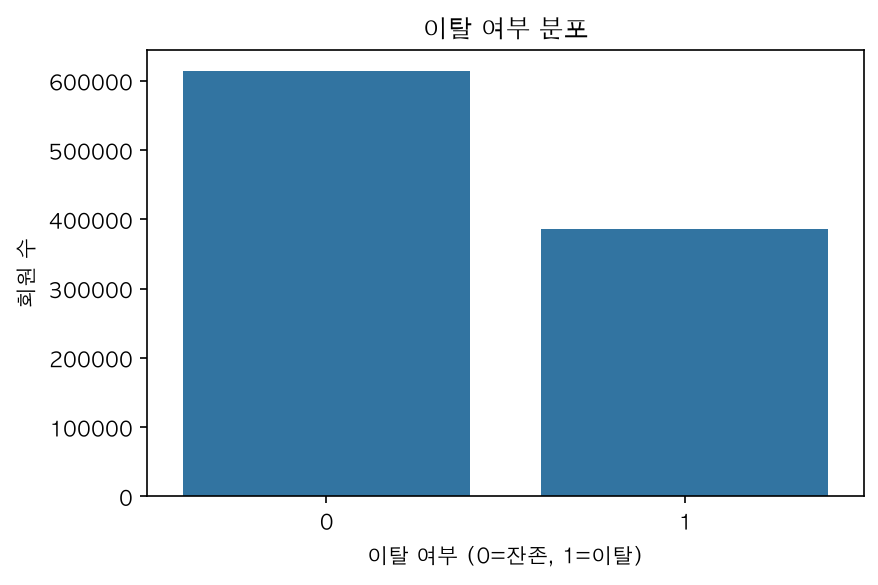
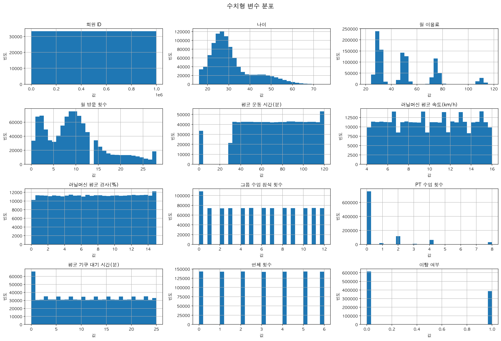
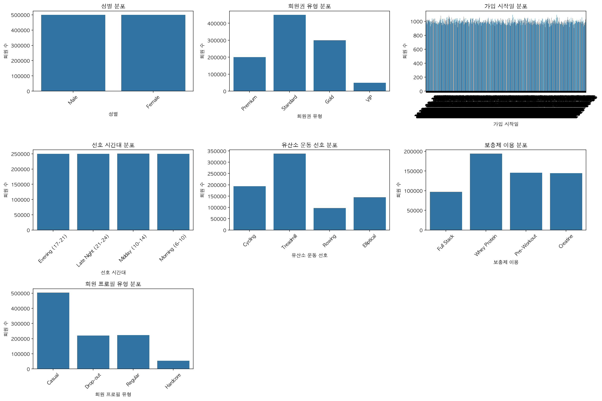
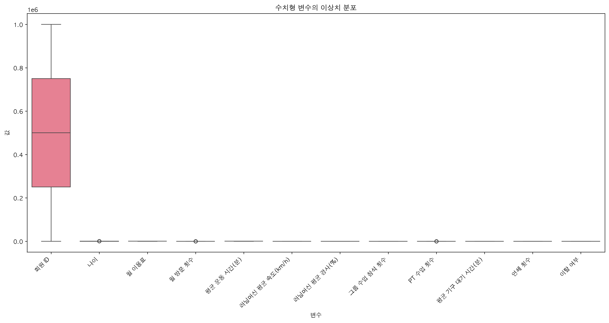
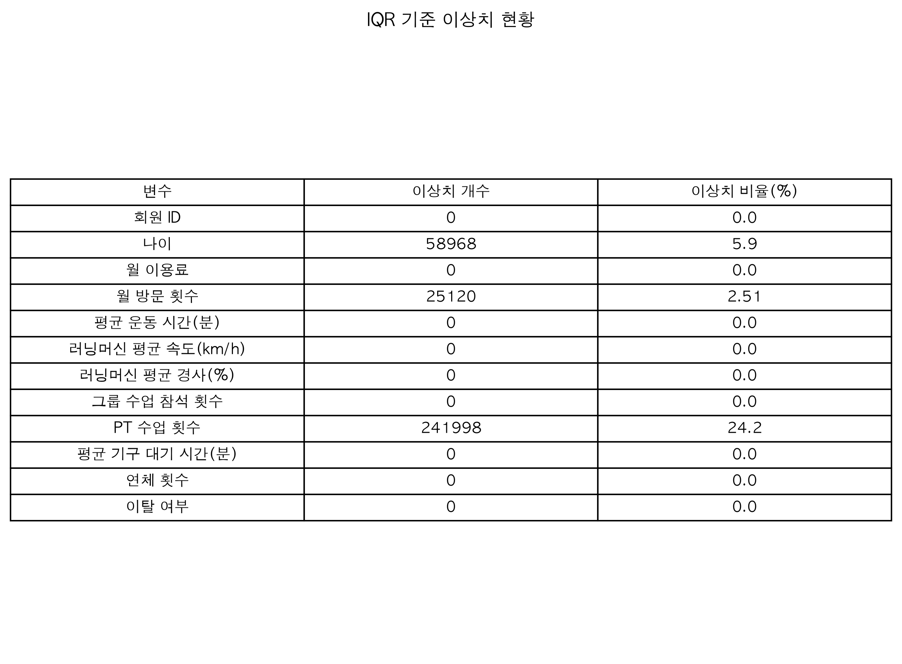
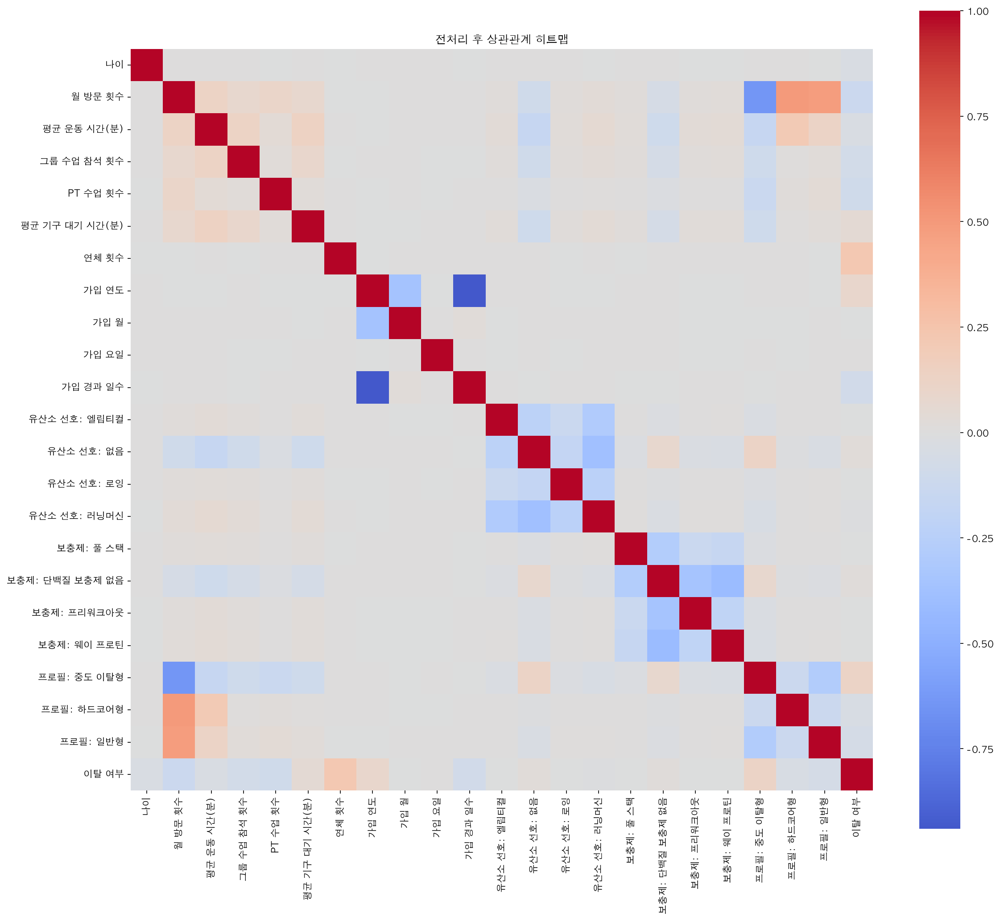

# Gym Churn Insight: 회원 이탈 예측 프로젝트

1. [프로젝트 개요](#1-프로젝트-개요)
2. [팀 소개](#2-팀-소개)
3. [프로젝트 구조](#3-프로젝트-구조)
4. [개발 환경](#4-개발-환경)
5. [설치 및 실행 방법](#5-설치-및-실행-방법)
6. [데이터 구성](#6-데이터-구성)
7. [데이터 전처리](#7-데이터-전처리)
8. [모델 목록 및 학습](#8-모델-목록-및-학습)
9. [평가 지표](#9-평가-지표)
10. [결과](#10-결과)
11. [Git 협업 규칙](#11-git-협업-규칙)
12. [모델 및 데이터 파일 규칙](#12-모델-및-데이터-파일-규칙)
13. [향후 개선 사항](#13-향후-개선-사항)
14. [회고](#14-회고)
15. [Model 비교 및 Streamlit 실행](#model-비교-및-streamlit-실행)


---------------------------------------

## 1. 프로젝트 개요

* **프로젝트 명**
    : 헬스장 회원 이탈(Churn) 예측 프로젝트

* **프로젝트 소개**
    : 100만 건 규모의 헬스장 회원 데이터를 기반으로, 회원의 인구통계·이용 패턴·행동 이력 데이터를 분석하여 이탈(Churn) 여부를 예측하는 프로젝트입니다. EDA를 통해 이탈에 실질적으로 영향을 주는 변수(연체 건수, 방문 빈도, 참여도 지표 등)와 영향이 없는 변수(성별, 요금제, 선호 시간대 등)를 구분하고, 데이터 전처리(결측치 처리, 인코딩, 스케일링) 및 Feature Selection을 거쳐 여러 머신러닝/딥러닝 모델(Logistic Regression, XGBoost, Deep Learning 등)의 성능을 비교합니다.

* **프로젝트 목표**
    - 데이터 정제 및 분석
        - 결측치 처리, 불필요 컬럼 제거, 파생변수 생성(가입일 기반), 인코딩, 스케일링
        - EDA를 통한 변수별 Churn 영향력 분석 (범주형 교차분석, 수치형 상관관계 분석)
        - XGBoost Feature Importance 기반 변수 선택
    - 머신러닝 모델 선택
        - Logistic Regression, XGBoost, Deep Learning 등 다중 모델 비교
        - 클래스 불균형(61.43% : 38.57%)을 고려한 평가 지표 설정
    - 결과 확인 및 분석
        - 모델별 성능 비교 (F1-score, Recall, ROC-AUC 등)
        - 이탈에 영향을 미치는 핵심 요인 도출 및 비즈니스 인사이트 정리

----

## 2. 팀 소개

🧑‍🔬 **팀명:** **Gymnasium**

📖 **팀 소개**

강화학습(Reinforcement Learning) 환경을 제공하는 라이브러리인 **Gymnasium**에서 영감을 받아 팀명을 정했습니다. 프로젝트의 주제는 헬스장이지만, AI를 활용한 데이터 분석과 머신러닝 모델 개발이라는 공통점을 담고자 이 이름을 선택했습니다. 실제 Gymnasium이 다양한 AI 에이전트가 환경과 상호작용하며 학습하는 것처럼, 저희도 헬스장 회원 데이터를 기반으로 모델을 학습하여 회원 이탈을 예측하고, 데이터 기반의 의미 있는 인사이트를 도출하는 것을 목표로 합니다.

👥 **팀원**

- 신진호: Gitcatho
- 오호민: necknam
- 주상현: shju0924-ai
- 최지흠: RabbitTasteDog-PRO

---
## 3. 프로젝트 구조

```text
Project-2nd/
├── .env.example                           # 환경변수 예시
├── .gitignore
├── .python-version                        # Python 3.12
├── AGENTS.md
├── README.md
├── EDA.md                                 # EDA 분석 문서
├── RESULT.md                              # 모델 평가 및 결과 문서
├── GUIDE.md                               # 프로젝트 사용 안내
├── requirements.txt
├── run.py                                 # Streamlit 실행 진입점
├── Viewer.py                              # 결과 확인 실행 파일
├── utils.py                               # 공통 유틸리티
├── configs/
│   └── model_params.yaml                  # 모델별 하이퍼파라미터
├── components/                            # Streamlit 화면 구성 요소
│   ├── sidebar.py
│   ├── single_view.py                     # 단일 모델 결과 화면
│   └── compare_view.py                    # 모델 비교 화면
├── data/
│   ├── raw/
│   │   └── gym_churn_1M_dataset.csv       # 원본 회원 데이터
│   ├── processed/                         # 전처리 데이터 (Git 제외)
│   │   ├── churn_preprocessed_full.csv    # 전체 특성 데이터
│   │   └── churn_preprocessed_pct50.csv   # 중요도 상위 50% 특성 데이터
│   ├── eda/
│   │   ├── boxplot.png
│   │   ├── categorical_distribution.png
│   │   ├── churn_class_distribution.png
│   │   ├── correlation_heatmap.png
│   │   ├── correlation_heatmap_2.png
│   │   ├── iqr_result.png
│   │   ├── numeric_distribution.png
│   │   └── korea_desc/                    # 한글 제목·축 설명 EDA 이미지
│   │       └── *.png
│   ├── evaluation/                        # 평가 실행 산출물
│   │   ├── plots/                         # ROC Curve·Confusion Matrix 이미지
│   │   ├── saved_params/                  # 평가에 사용한 파라미터(JSON)
│   │   └── saved_models/                  # 재현 가능한 학습 모델(joblib, Git 제외)
│   ├── results/                           # Viewer용 모델 결과
│   │   ├── *_results.json                 # 모델·특성 조합별 성능 지표
│   │   ├── result_data.json               # 결과 목록 통합 데이터
│   │   └── roc/                           # ROC Curve 생성용 Parquet 데이터
│   └── model_list.json                    # Viewer용 모델·특성 목록
├── models/                                # 저장된 최종 파이프라인·메타데이터
│   ├── *_pipeline.joblib
│   └── *_metadata.json
├── notebooks/
│   └── 01_EDA.ipynb                       # 탐색적 데이터 분석 노트북
├── src/
│   ├── config.py
│   ├── common/
│   │   └── results.py                     # 결과 저장·로드 공통 함수
│   ├── eda/
│   │   └── generate_korean_eda.py         # 한글 EDA 이미지 생성
│   ├── environment/
│   │   ├── runtime_environment.py
│   │   └── setup_python312_env.py         # 가상환경·의존성 설정
│   ├── evaluation/
│   │   ├── evaluation_plot.py             # ROC·Confusion Matrix 생성
│   │   └── model_eval.py                  # 전체 모델 학습·평가 실행
│   ├── models/
│   │   ├── model_knn.py
│   │   ├── model_lightgbm.py
│   │   ├── model_logistic.py
│   │   ├── model_randomforest.py
│   │   ├── model_xgboost.py
│   │   ├── DL.py
│   │   └── train_*.py                     # 개별 모델 학습 스크립트
│   └── preprocessing/
│       └── preprocessing.py               # 결측치·인코딩·스케일링·특성 선택
├── tests/
│   ├── test_result_paths.py
│   └── test_setup_python312_env.py
├── skills/
│   └── churn-ml-project/                  # 프로젝트 전용 Codex 스킬
└── project_structure.py                   # 구조 목록 생성 스크립트
```


---

## 4. 개발 환경

<div align="center">


</div>

세부 버전 범위와 운영체제별 호환성(NumPy·PyTorch)은 [requirements.txt](requirements.txt)를 따릅니다.

----------

## 5. 설치 및 실행 방법

### 가상환경과 필요 라이브러리 설치

프로젝트 루트에서 Python 3.12로 아래 명령을 실행합니다.

```bash
python src/environment/setup_python312_env.py
```

기존 `.venv`가 Python 3.12가 아니라면 다음 명령으로 다시 만듭니다.

```bash
python src/environment/setup_python312_env.py --recreate
```

macOS에서 XGBoost용 OpenMP 런타임이 아직 없다면 아래 명령으로 Homebrew의 `libomp`까지 설치합니다.

```bash
python src/environment/setup_python312_env.py --install-system-dependencies
```

**가상환경 설치 완료 후 모델을 실행합니다.**
```bash
python src/evaluation/model_eval.py
```


스크립트는 가상환경 생성, `requirements.txt` 설치, `pip check`, 패키지 import 검증을 순서대로 수행합니다.

| 환경 | 주요 의존성 분기 | 실행 장치 |
|------|----------------|----------|
| Intel Mac | NumPy 1.x, PyTorch 2.2.x, Numba 0.62.x와 llvmlite 0.45.x, Homebrew libomp | CPU |
| Apple Silicon Mac | NumPy 2.x, PyTorch 2.6 이상, Homebrew libomp | MPS 또는 CPU |
| Windows | NumPy 2.x, PyTorch 2.6 이상 | CUDA 가능 시 CUDA, 그 외 CPU |

`requirements.txt`의 플랫폼 마커가 각 환경에 맞는 버전을 자동으로 선택하므로, 운영체제별로 별도 requirements 파일을 사용할 필요는 없습니다.

### 결과 확인
- 평가 결과(JSON): data/eval/
- ROC Curve 및 Confusion Matrix: data/plots/
- 모델 성능 비교: RESULT.md

### 필수

---

## 6. 데이터 구성

대용량 CSV 파일은 저장소 용량을 고려해 Git 추적에서 제외되어 있습니다. 아래 링크에서
다운로드한 뒤, 표의 경로와 파일명으로 저장하세요.

| 데이터 | 다운로드 | 저장 경로 |
|--------|----------|-----------|
| 전체 원본 데이터 | [Google Drive](https://drive.google.com/file/d/1NLmsnvaG223c5zYAuNXj0Bwf9lFvJOOp/view?usp=drive_link) | `data/processed/churn_preprocessed_full.csv` |
| 50% 전처리 데이터 | [Google Drive](https://drive.google.com/file/d/1aOtOPiCOc3eQxbQjzk5Po4067bMoYON9/view?usp=drive_link) | `data/processed/churn_preprocessed_pct50.csv` |

`data/raw/` 및 `data/processed/`의 CSV는 `.gitignore` 규칙으로 인해 커밋되지 않습니다.

---

## 7. 데이터 전처리

원본 데이터(`gym_churn_1M_dataset.csv`) 100만 건을 대상으로 전처리한 뒤, 전체 특성 데이터와 XGBoost 중요도 상위 50% 특성 데이터를 각각 생성합니다. 모든 스케일러는 학습 데이터에만 `fit`한 뒤 검증 데이터에 적용하여 데이터 누수를 방지했습니다.

```text
원본 데이터 로드
    → 결측치 대체
    → 불필요·결측 과다 컬럼 제거
    → 가입일 기반 파생변수 생성
    → 범주형 원-핫 인코딩
    → Train/Test 80:20 계층 분할
    → 변수 특성에 맞는 스케일링
    → XGBoost 중요도 기반 상위 50% 특성 선택
    → full / pct50 전처리 데이터 저장
```

| 단계 | 적용 내용 |
|------|----------|
| 결측치 처리 | `Cardio_Preference`는 `No Preference`, `Supplement_Usage`는 `No Protein Supplements`로 대체합니다. |
| 컬럼 제거 | 식별자(`Member_ID`), 결측 비율이 높은 러닝머신 속도·경사, EDA에서 이탈과의 관련성이 낮다고 판단한 성별·회원권 유형·선호 시간대·월 이용료를 제거합니다. |
| 파생변수 | `Membership_Start_Date`에서 가입 연도·월·요일을 추출하고, 기준일 대비 `Membership_Days`(가입 경과 일수)를 생성합니다. |
| 인코딩 | 유산소 운동 선호, 보충제 이용, 회원 프로필 유형에 `pd.get_dummies(..., drop_first=True)`를 적용합니다. |
| 데이터 분할 | `random_state=42`, 이탈 여부 비율을 유지하는 계층 추출로 Train 80% / Test 20%를 분리합니다. |
| 스케일링 | 연속형 변수에는 `StandardScaler`, PT 수업 횟수·연체 횟수에는 이상치 영향이 작은 `RobustScaler`를 적용합니다. |
| 특성 선택 | XGBoost Feature Importance 순위에서 22개 입력 특성 중 상위 11개(50%)를 선택합니다. |

중복 행 제거와 이상치 제거는 현재 전처리 파이프라인에 별도 단계로 포함하지 않았습니다. 연체 횟수와 PT 수업 횟수처럼 분포가 치우친 변수는 삭제하지 않고 `RobustScaler`로 스케일링합니다.

### 전처리 결과

| 파일 | 구성 | 크기 |
|------|------|------|
| `data/processed/churn_preprocessed_full.csv` | 전체 입력 특성 22개 + 타깃(`Churn`) | 1,000,000행 × 23열 |
| `data/processed/churn_preprocessed_pct50.csv` | 중요도 상위 입력 특성 11개 + 타깃(`Churn`) | 1,000,000행 × 12열 |

### 실행 방법

프로젝트 루트에서 다음 명령을 실행합니다. 현재 전처리 스크립트는 상대경로를 사용하므로 `src/preprocessing/`에서 실행해야 합니다.

```bash
(cd src/preprocessing && ../../.venv/bin/python preprocessing.py)
```

### 핵심 전처리 코드

아래는 [`src/preprocessing/preprocessing.py`](src/preprocessing/preprocessing.py)의 핵심 처리 흐름입니다.

```python
import os
import pandas as pd
import xgboost as xgb
from sklearn.model_selection import train_test_split
from sklearn.preprocessing import RobustScaler, StandardScaler

churn = pd.read_csv("../../data/raw/gym_churn_1M_dataset.csv", na_values=[""])

# 결측치 처리
churn["Cardio_Preference"] = churn["Cardio_Preference"].fillna("No Preference")
churn["Supplement_Usage"] = churn["Supplement_Usage"].fillna("No Protein Supplements")

# 불필요·결측 과다 컬럼 제거
columns_to_drop = [
    "Member_ID", "Treadmill_Avg_Speed_Kmh", "Treadmill_Avg_Incline_Pct",
    "Gender", "Membership_Type", "Peak_Hour_Preference", "Monthly_Fee",
]
churn = churn.drop(columns=columns_to_drop)

# 가입일 기반 파생변수 생성
churn["Membership_Start_Date"] = pd.to_datetime(churn["Membership_Start_Date"])
churn["Start_Year"] = churn["Membership_Start_Date"].dt.year
churn["Start_Month"] = churn["Membership_Start_Date"].dt.month
churn["Start_Weekday"] = churn["Membership_Start_Date"].dt.weekday
churn["Membership_Days"] = (
    churn["Membership_Start_Date"].max() - churn["Membership_Start_Date"]
).dt.days
churn = churn.drop(columns=["Membership_Start_Date"])

# 원-핫 인코딩 및 계층 분할
churn = pd.get_dummies(
    churn,
    columns=["Cardio_Preference", "Supplement_Usage", "Profile_Type"],
    drop_first=True,
)
X, y = churn.drop(columns=["Churn"]), churn["Churn"]
X_train, X_test, y_train, y_test = train_test_split(
    X, y, test_size=0.2, random_state=42, stratify=y
)

standard_cols = [
    "Age", "Monthly_Visits", "Avg_Workout_Duration_Min",
    "Group_Class_Attendance", "Avg_Equipment_Wait_Time_Min",
    "Start_Year", "Start_Month", "Start_Weekday", "Membership_Days",
]
robust_cols = ["PT_Session_Count", "Late_Payment_Count"]
standard_scaler, robust_scaler = StandardScaler(), RobustScaler()

# Train 데이터 기준 스케일링
X_train[standard_cols] = standard_scaler.fit_transform(X_train[standard_cols])
X_test[standard_cols] = standard_scaler.transform(X_test[standard_cols])
X_train[robust_cols] = robust_scaler.fit_transform(X_train[robust_cols])
X_test[robust_cols] = robust_scaler.transform(X_test[robust_cols])

# XGBoost 중요도 상위 50% 특성 선택
xgb_model = xgb.XGBClassifier(
    n_estimators=200, max_depth=6, learning_rate=0.1,
    random_state=42, eval_metric="logloss", n_jobs=-1,
)
xgb_model.fit(X_train, y_train)
importance_df = pd.DataFrame({
    "Feature": X_train.columns,
    "Importance": xgb_model.feature_importances_,
}).sort_values("Importance", ascending=False)
top_features = importance_df["Feature"].head(len(importance_df) // 2).tolist()

# 전체 특성 / 상위 50% 특성 데이터 저장
full_data = pd.concat([
    X_train.assign(Churn=y_train),
    X_test.assign(Churn=y_test),
]).sort_index()
os.makedirs("../../data/processed", exist_ok=True)
full_data.to_csv("../../data/processed/churn_preprocessed_full.csv", index=False)
full_data[top_features + ["Churn"]].to_csv(
    "../../data/processed/churn_preprocessed_pct50.csv", index=False
)
```

EDA 분석 근거는 [EDA.md](EDA.md), 전처리 후 모델 평가 결과는 [RESULT.md](RESULT.md)에서 확인할 수 있습니다.

---

## 8. 모델 목록 및 학습

### 모델 목록

| 담당자 | 모델 | 역할 |
|--------|------|------|
| 최지흠 | KNN, Logistic Regression | 거리 기반 기준 모델과 선형 이진 분류 모델 구현 |
| 신진호 | XGBoost, LightGBM, Random Forest | 트리 기반 앙상블 머신러닝 모델 구현 및 비교 |
| 주상현 | MLP (PyTorch) | 다층 퍼셉트론 기반 딥러닝 모델 구현 |

KNN·Logistic Regression·XGBoost·LightGBM·Random Forest는 전체 특성(`full`)과 중요도 상위 50% 특성(`pct50`) 데이터로 비교하며, MLP는 전체 특성 데이터를 기준으로 학습합니다.

### 모델 학습

| 항목 | 적용 내용 |
|------|----------|
| 기본 평가 분할 | Train 80% / Test 20% |
| 분할 방식 | `stratify=y`를 적용하여 유지·이탈 클래스 비율 보존 |
| Random State | 42 |
| Validation | 개별 학습 스크립트에서 임계값 선택(KNN·Logistic Regression·XGBoost)과 Early Stopping(XGBoost) 용도로 별도 사용 |
| Cross Validation | 미적용 |

전체 모델 비교는 [`src/evaluation/model_eval.py`](src/evaluation/model_eval.py)에서 동일한 Train/Test 조건으로 수행합니다. 현재 프로젝트는 K-Fold Cross Validation 대신 고정 Hold-out 방식을 사용하며, 모델별 성능은 Accuracy뿐 아니라 Precision, Recall, F1 Score, ROC-AUC, PR-AUC 및 추론 시간으로 비교합니다.

---

## 9. 평가 지표

| Metric | 설명 |
|--------|------|
| Accuracy | 정확도 |
| Precision | 정밀도 |
| Recall | 재현율 |
| F1 Score | F1 점수 |
| ROC AUC | ROC-AUC |
| Confusion Matrix | 혼동 행렬 |
| Latency | 평균 추론 시간 |
| Total Time | 전체 실행 시간 |

---

## 10. 결과

### EDA 결과

원본 데이터는 헬스장 회원 1,000,000명의 인구통계·이용 행동·결제 이력과 이탈 여부를 포함합니다.

| 항목 | 결과 |
|------|------|
| 전체 회원 | 1,000,000명 |
| 유지 회원 (`Churn=0`) | 614,298명 (61.43%) |
| 이탈 회원 (`Churn=1`) | 385,702명 (38.57%) |
| 원본 컬럼 | 19개 |
| 중복 행 | 0건 |

#### 이탈 클래스 분포



유지 회원이 이탈 회원보다 많지만 이탈 회원도 전체의 38.57%를 차지합니다. 따라서 Accuracy만으로 모델을 판단하지 않고 Precision, Recall, F1 Score, ROC-AUC와 PR-AUC를 함께 사용했습니다.

#### 유지·이탈 회원의 행동 차이

| 변수 | 유지 회원 평균 | 이탈 회원 평균 | EDA 해석 |
|------|---:|---:|------|
| 월 방문 횟수 | 10.42회 | 8.70회 | 방문 빈도가 낮을수록 이탈이 증가하는 경향 |
| 평균 운동 시간 | 73.32분 | 71.17분 | 이탈 회원의 운동 시간이 다소 짧음 |
| 그룹 수업 참석 | 6.04회 | 5.42회 | 그룹 수업 참여가 낮을수록 이탈이 증가하는 경향 |
| PT 수업 횟수 | 0.94회 | 0.60회 | 이탈 회원의 PT 참여가 적음 |
| 평균 기구 대기 시간 | 11.78분 | 12.58분 | 대기 시간이 길수록 이탈이 소폭 증가하는 경향 |
| 연체 횟수 | 2.64회 | 3.57회 | 이탈 회원의 연체 횟수가 더 많음 |

이 차이는 인과관계를 의미하지 않지만, 전반적으로 **헬스장 이용 참여도가 낮고 결제 연체가 많을수록 이탈 가능성이 높아지는 패턴**을 보여 줍니다.

#### 변수 분포





- `Gender`, `Membership_Type`, `Peak_Hour_Preference`, `Monthly_Fee`는 이탈 여부에 따른 차이가 작아 현재 모델 입력에서 제외했습니다.
- `Profile_Type`은 범주형 변수 중 이탈률 차이가 가장 뚜렷했으며, Drop-out 유형의 이탈률은 49.66%, Hardcore 유형은 30.33%였습니다.
- `Membership_Start_Date`는 연도·월·요일·가입 경과 일수로 변환하여 원본 날짜보다 모델이 활용하기 쉬운 형태로 사용했습니다.

#### 이상치 확인





나이, 월 방문 횟수, PT 수업 횟수에서 일부 이상치가 확인됐지만 실제 회원의 다양한 이용 행동을 나타낼 수 있어 제거하지 않았습니다. 분포가 치우친 PT 수업 횟수와 연체 횟수에는 `RobustScaler`를 적용했습니다.

#### 전처리 후 상관관계



| 순위 | 변수 | Churn 상관계수 | 해석 |
|---:|------|---:|------|
| 1 | `Late_Payment_Count` | +0.2245 | 연체가 많을수록 이탈 증가 |
| 2 | `Monthly_Visits` | -0.1237 | 방문 횟수가 적을수록 이탈 증가 |
| 3 | `PT_Session_Count` | -0.0942 | PT 참여가 적을수록 이탈 증가 |
| 4 | `Group_Class_Attendance` | -0.0784 | 그룹 수업 참여가 적을수록 이탈 증가 |
| 5 | `Avg_Equipment_Wait_Time_Min` | +0.0526 | 대기 시간이 길수록 이탈 소폭 증가 |

단일 변수의 상관계수는 모두 강하지 않으므로, 여러 이용·결제·회원 특성을 함께 학습하는 분류 모델이 필요하다고 판단했습니다.

### 모델 평가 결과

아래는 중요도 상위 50%인 11개 특성을 사용한 모델 비교 결과입니다.

| Model | Accuracy | Precision | Recall | F1 Score | ROC-AUC | PR-AUC |
|------|---:|---:|---:|---:|---:|---:|
| KNN | 0.6327 | 0.5427 | 0.3023 | 0.3883 | 0.6283 | 0.4892 |
| Logistic Regression | 0.6574 | 0.5889 | 0.3699 | 0.4544 | 0.6797 | 0.5591 |
| Random Forest | 0.6484 | 0.5670 | 0.3742 | 0.4509 | 0.6607 | 0.5367 |
| **LightGBM** | **0.6635** | **0.6004** | **0.3815** | **0.4665** | 0.6876 | 0.5699 |
| XGBoost | 0.6628 | 0.6000 | 0.3773 | 0.4633 | **0.6877** | **0.5702** |

LightGBM 50은 Accuracy, Recall, F1 Score가 가장 높고 전체 특성 모델과 비슷한 성능을 더 적은 특성으로 달성해 최종 캠페인 대상 선정 모델로 선택했습니다. 다만 임계값 0.5에서 Recall은 약 38%이므로, 실제 이탈 회원을 더 많이 탐지하려면 캠페인 예산과 오탐 비용을 고려해 임계값을 낮추는 추가 검토가 필요합니다.

EDA 전체 분석은 [EDA.md](EDA.md), 모델별 상세 결과·혼동행렬·ROC Curve·캠페인 선정 기준은 [RESULT.md](RESULT.md)에서 확인할 수 있습니다.

----

## 11. Git 협업 규칙

브랜치 생성, 커밋 메시지, 작업 순서, Pull Request 및 최종 점검 기준은 [GUIDE.md의 Git 협업 규칙](GUIDE.md#9-git-협업-규칙)을 참고하세요.

---

## 12. 모델 및 데이터 파일 규칙

모델·데이터·평가 산출물의 저장 위치, 일반 파일명 형식, 결과 JSON 및 ROC Parquet 구성은 [GUIDE.md의 모델·데이터 파일 및 결과 저장 규칙](GUIDE.md#10-모델데이터-파일-및-결과-저장-규칙)을 참고하세요.

---


## 13. 향후 개선 사항

현재 최종 모델인 LightGBM 50은 임계값 0.5에서 Recall이 약 38%로, 실제 이탈 회원의 약 62%를 놓칩니다.
이후에는 Accuracy의 소폭 향상보다 실제 이탈 회원 탐지와 캠페인 효율 개선을 우선합니다.

| 우선순위 | 개선 항목 | 개선 방향 |
|---:|------|------|
| 1 | 분류 임계값 최적화 | Validation 데이터에서 임계값별 Precision·Recall·F1 Score와 캠페인 대상 수를 비교하고, 쿠폰·상담 비용을 반영한 운영 임계값을 결정합니다. |
| 2 | 하이퍼파라미터 최적화 | LightGBM·XGBoost의 트리 깊이, 학습률, 트리 수, 정규화 파라미터를 Optuna 등으로 탐색합니다. Test 데이터는 최종 평가에만 사용합니다. |
| 3 | 교차검증 도입 | 현재 고정 Hold-out 결과가 특정 데이터 분할에 의존하는지 확인하기 위해 Train 영역에서 Stratified K-Fold Cross Validation을 적용합니다. |
| 4 | 불균형 학습 비교 | `class_weight`, `scale_pos_weight`, 언더샘플링 등의 적용 전후를 PR-AUC·Recall 중심으로 비교합니다. SMOTE를 사용할 경우 학습 Fold 내부에서만 적용합니다. |
| 6 | 결측치 처리 실험 | 현재 범주값 대체 및 컬럼 제거 방식과 최빈값·중앙값·결측 여부 파생변수 방식의 성능 차이를 비교합니다. |
| 8 | 실제 데이터 검증 | 현재 케글 합성 데이터에서 확인한 패턴이 실제 헬스장 데이터에서도 재현되는지 검증하고, 시간 순서에 따른 Train/Test 분리로 미래 고객에 대한 일반화 성능을 확인합니다. |
| 9 | 캠페인 효과 검증 | 고위험 회원을 대상으로 A/B Test를 진행하여 실제 이탈률, 재방문율, 유지율, 캠페인 비용 대비 효과를 측정합니다. |
| 10 | 운영 모니터링 | 배포 후 입력 데이터 분포, 이탈률, Precision·Recall, 예측 지연 시간을 정기적으로 확인하고 성능 저하 시 재학습합니다. |

최종적으로는 모델 점수만 높이는 것이 아니라, **한정된 캠페인 예산으로 실제 이탈을 얼마나 줄였는지**를 기준으로 모델과 임계값을 평가하는 것을 목표로 합니다.

---

## 14. 회고


### 오호민 (전체 구조 구상, ERD 구성, Streamlit 구조 설계)
- 프로젝트 전체 아키텍처를 설계하며 데이터 수집, 저장, 조회, 시각화까지의 흐름을 체계적으로 구성하는 경험을 할 수 있었습니다.
- Streamlit 구조를 모듈화하고 컴포넌트를 재사용할 수 있도록 설계하면서 유지보수성과 확장성을 고려한 개발의 중요성을 배웠습니다.
- 모바일 환경에서도 편리하게 사용할 수 있도록 UI/UX를 개선하며 사용자 중심 설계 경험을 쌓을 수 있었습니다.

### 신진호

### 주상현

### 최지흠


---

## Model 비교 및 Streamlit 실행

아래 순서대로 실행합니다. 6번은 전처리 CSV가 이미 있으면 생략할 수 있으며, 10번은 Streamlit을 종료한 뒤 선택적으로 실행합니다.

```bash
# 1. 프로젝트 루트로 이동
cd Project-2nd

# 2. Python 버전 확인 (Python 3.12 권장)
python --version

# 3. 원본 데이터 존재 여부 확인
ls data/raw/gym_churn_1M_dataset.csv

# 4. 가상환경 및 의존성 설치
python src/environment/setup_python312_env.py

# 5. 가상환경 활성화 (macOS/Linux)
source .venv/bin/activate

# 6. 전처리 데이터 생성 (필요한 경우에만 실행)
(cd src/preprocessing && ../../.venv/bin/python preprocessing.py)

# 7. 전체 모델의 full·50 기본 결과 생성
python src/evaluation/model_eval.py --baseline-only

# 8. ROC Curve·Confusion Matrix 이미지 생성
python src/evaluation/evaluation_plot.py

# 9. Streamlit 비교 화면 실행
streamlit run run.py

# 10. Streamlit 종료 후 개별 모델 결과를 터미널에서 확인 (선택)
python Viewer.py
```

Windows에서는 5번 대신 아래 명령으로 가상환경을 활성화합니다.

```powershell
.venv\Scripts\activate
```
