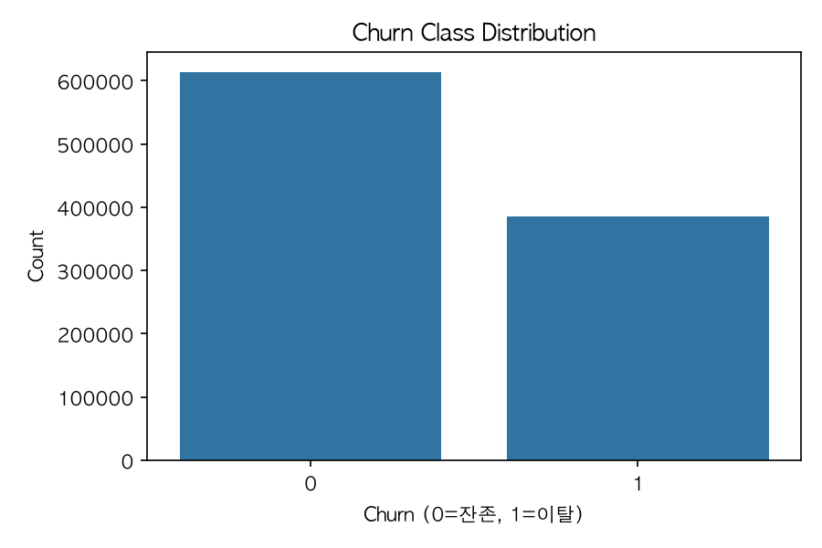
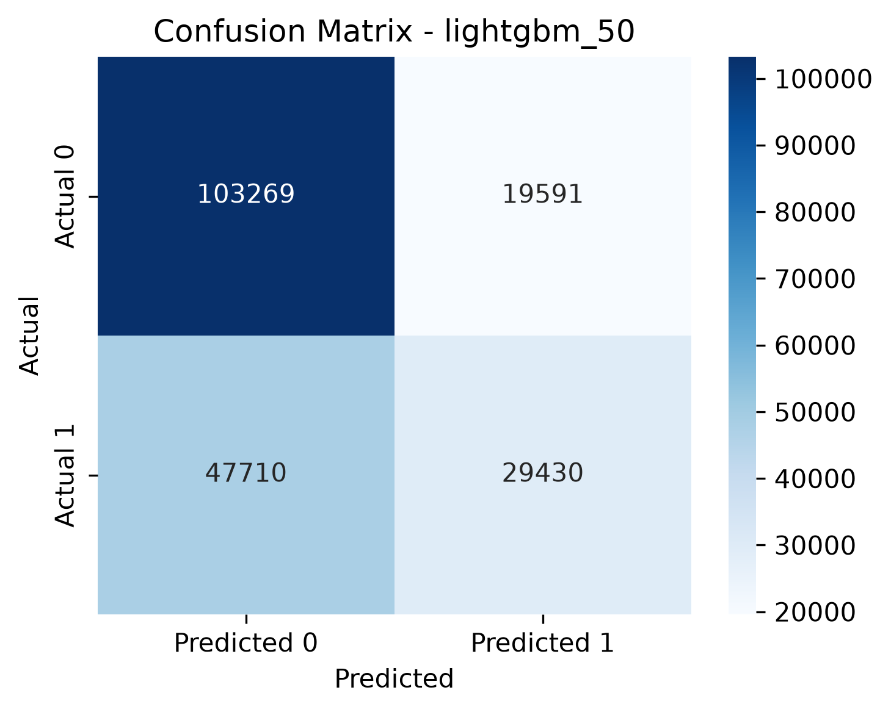
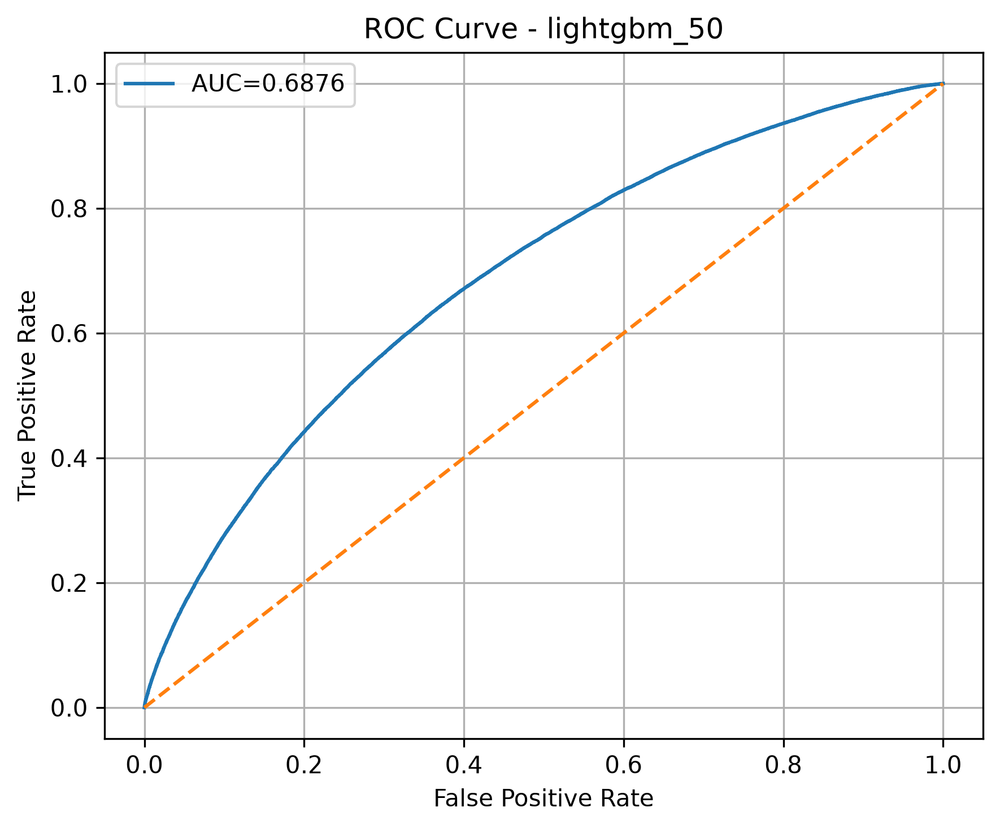

# 모델 평가 결과

## 1. 전처리 전 데이터 현황

원본 데이터는 헬스장 회원 1,000,000명의 이용·결제·운동 행동 정보와 이탈 여부를 담고 있다. 

전처리 전 데이터는 19개 컬럼으로 구성되며, 회원 식별자(`Member_ID`)와 예측 대상(`Churn`)을 포함한다.

| 항목 | 값 |
|---|---:|
| 회원 수 | 1,000,000명 |
| 원본 컬럼 수 | 19개 |
| 유지 회원 (Churn = 0) | 614,298명 (61.43%) |
| 이탈 회원 (Churn = 1) | 385,702명 (38.57%) |
| 원본 데이터 중복 행 | 0건 |

---

---
## 2. 전처리 전 데이터에서 확인한 점

### 결측치 현황

| 컬럼 | 결측 수 | 결측 비율 | 전처리 방식 |
|---|---:|---:|---|
| Cardio_Preference | 226,685 | 22.67% | `No Preference`로 대체 |
| Supplement_Usage | 419,573 | 41.96% | `No Protein Supplements`로 대체 |
| Treadmill_Avg_Speed_Kmh | 662,402 | 66.24% | 컬럼 제거 |
| Treadmill_Avg_Incline_Pct | 662,402 | 66.24% | 컬럼 제거 |

### 유지·이탈 회원의 행동 차이

| 항목 | 유지 회원 평균 | 이탈 회원 평균 | 관찰 내용 |
|---|---:|---:|---|
| 월 방문 수 | 10.42회 | 8.70회 | 이탈 회원의 방문 빈도가 낮음 |
| 평균 운동 시간 | 73.32분 | 71.17분 | 이탈 회원의 운동 시간이 다소 짧음 |
| 그룹 수업 참석 | 6.04회 | 5.42회 | 이탈 회원의 그룹 수업 참여가 적음 |
| PT 이용 횟수 | 0.94회 | 0.60회 | 이탈 회원의 PT 이용이 적음 |
| 평균 기구 대기 시간 | 11.78분 | 12.58분 | 이탈 회원의 대기 시간이 더 김 |
| 연체 횟수 | 2.64회 | 3.57회 | 이탈 회원의 연체 횟수가 더 많음 |

이 수치는 이탈의 원인을 단정하는 근거가 아니라, 이탈 회원과 유지 회원 사이에서 관찰된 차이다. 이탈 비율이 38.57%이므로 Accuracy만으로 모델을 판단하지 않고 Precision, Recall, F1 Score를 함께 평가한다.

## 3. 전처리 과정

1. `Cardio_Preference`와 `Supplement_Usage`의 결측값을 각각 `No Preference`, `No Protein Supplements`로 대체했다.
2. 식별자 컬럼인 `Member_ID`와 결측 비율이 높은 러닝머신 속도·경사 컬럼을 제거했다. 현재 모델 입력에서는 `Gender`, `Membership_Type`, `Peak_Hour_Preference`, `Monthly_Fee`도 제외했다.
3. `Membership_Start_Date`에서 가입 연도, 가입 월, 가입 요일, 가입 후 경과일(`Membership_Days`)을 파생하고 원본 날짜 컬럼은 제거했다.
4. 유산소 운동 선호도, 보충제 이용 여부, 프로필 유형은 원-핫 인코딩으로 수치화했다.
5. 데이터는 이탈 비율을 유지하는 계층화 80:20 Train/Test 분할 후 스케일링했다. 일반 수치형 변수에는 StandardScaler, 연체·PT 횟수에는 이상치 영향을 줄이는 RobustScaler를 적용했다.
6. Train 데이터로 학습한 XGBoost의 피처 중요도에서 상위 50%인 11개 피처를 별도 데이터셋으로 구성했다.

## 4. 전처리 후 데이터셋

| 데이터셋 | 행 수 | 모델 입력 피처 수 | Target | 결측치 | 용도 |
|---|---:|---:|---|---:|---|
| `churn_preprocessed_full.csv` | 1,000,000 | 22개 | Churn | 0건 | 전체 피처 모델 비교 |
| `churn_preprocessed_pct50.csv` | 1,000,000 | 11개 | Churn | 0건 | 중요도 상위 50% 피처 모델 비교 |

원본 데이터는 날짜 파생 변수와 원-핫 인코딩 때문에 `full` 데이터셋에서 22개 입력 피처로 변환됐다. `50` 데이터셋은 이 중 중요도 상위 11개만 남겨, 성능을 크게 낮추지 않으면서 더 간결한 모델을 만들기 위한 비교 기준이다.

## 5. 실험 기준

- Target: Churn
- 데이터: 회원 1,000,000명
- Train / Test: 80% / 20% (Test 200,000명)
- Random State: 42
- 평가 지표: Accuracy, Precision, Recall, F1 Score, ROC-AUC
- 분류 임계값: 0.5
- 비교 기준: 전체 피처와 상위 50% 피처

## 6. 전체 피처 모델 비교

| Model | Accuracy | Precision | Recall | F1 Score | ROC-AUC | Latency (ms) |
|---|---:|---:|---:|---:|---:|---:|
| KNN | 0.6272 | 0.5325 | 0.2737 | 0.3616 | 0.6138 | 2.6182 |
| Logistic Regression | 0.6587 | 0.5920 | 0.3702 | 0.4555 | 0.6816 | 0.0004 |
| Random Forest | 0.6528 | 0.5797 | 0.3632 | 0.4465 | 0.6678 | 0.1128 |
| LightGBM | 0.6633 | 0.5999 | 0.3813 | 0.4662 | 0.6876 | 0.0121 |
| XGBoost | 0.6629 | 0.6001 | 0.3773 | 0.4633 | 0.6875 | 0.0018 |

## 7. 상위 50% 피처 모델 비교

| Model | Accuracy | Precision | Recall | F1 Score | ROC-AUC | Latency (ms) |
|---|---:|---:|---:|---:|---:|---:|
| KNN | 0.6327 | 0.5428 | 0.3022 | 0.3883 | 0.6283 | 1.2150 |
| Logistic Regression | 0.6574 | 0.5889 | 0.3699 | 0.4544 | 0.6797 | 0.0002 |
| Random Forest | 0.6484 | 0.5670 | 0.3742 | 0.4509 | 0.6607 | 0.0833 |
| LightGBM | 0.6635 | 0.6004 | 0.3815 | 0.4665 | 0.6876 | 0.0057 |
| XGBoost | 0.6631 | 0.6003 | 0.3785 | 0.4643 | 0.6876 | 0.0037 |

### 이번 모델링 재실행 결과 (2026-07-20)

아래 결과는 `src/evaluation/model_eval.py --baseline-only`를 다시 실행해 생성했다. 동일한 80:20 계층화 분할, `random_state=42`, 분류 임계값 0.5를 적용했으며, Test 데이터는 200,000명이다. Latency는 실행 환경의 영향을 받으므로 모델 선정에서는 분류 성능 지표를 우선으로 해석한다.

아래 표의 각 행은 하나의 모델이고, 각 열은 이탈 회원을 얼마나 잘 찾았는지를 나타낸다. 
- **Accuracy**는 
  - 전체 회원 중 예측이 맞은 비율 
- **Precision**은 
  - 이탈 위험으로 선정한 회원 중 실제 이탈한 비율, 
- **Recall**은 
  - 실제 이탈 회원 중 모델이 찾아낸 비율이다. 
- **F1 Score**
  - 는 Precision(정밀도)과 Recall(재현울)의 균형을, 
- **ROC-AUC**, **PR-AUC**
  - 는 임계값을 바꾸더라도 이탈 회원을 유지 회원보다 잘 구분하고 우선순위를 매기는지를 보여 준다.
- **Latency**는 
  - 회원 한 명을 예측하는 평균 시간(ms)이며 낮을수록 빠르다. 
 
 이탈 방지 캠페인에서는 Accuracy만 보지 않고, 
 
 실제 이탈 회원을 놓치지 않는 Recall과 불필요한 캠페인 발송을 줄이는 Precision·F1 Score를 함께 확인한다.

---

#### 전체 피처 (full)

| Model | Accuracy | Precision | Recall | F1 Score | ROC-AUC | PR-AUC | Latency (ms) |
|---|---:|---:|---:|---:|---:|---:|---:|
| KNN | 0.6272 | 0.5326 | 0.2738 | 0.3617 | 0.6138 | 0.4772 | 3.6990 |
| Logistic Regression | 0.6587 | 0.5920 | 0.3702 | 0.4555 | 0.6816 | 0.5610 | 0.0005 |
| Random Forest | 0.6528 | 0.5797 | 0.3632 | 0.4465 | 0.6678 | 0.5441 | 0.0557 |
| LightGBM | 0.6633 | 0.5999 | 0.3813 | **0.4662** | 0.6876 | 0.5697 | 0.0076 |
| XGBoost | 0.6630 | **0.6003** | 0.3774 | 0.4634 | **0.6877** | **0.5702** | 0.0022 |

#### 상위 50% 피처 (50)

| Model | Accuracy | Precision | Recall | F1 Score | ROC-AUC | PR-AUC | Latency (ms) |
|---|---:|---:|---:|---:|---:|---:|---:|
| KNN | 0.6327 | 0.5427 | 0.3023 | 0.3883 | 0.6283 | 0.4892 | 1.2058 |
| Logistic Regression | 0.6574 | 0.5889 | 0.3699 | 0.4544 | 0.6797 | 0.5591 | 0.0003 |
| Random Forest | 0.6484 | 0.5670 | 0.3742 | 0.4509 | 0.6607 | 0.5367 | 0.0505 |
| LightGBM | **0.6635** | **0.6004** | **0.3815** | **0.4665** | 0.6876 | 0.5699 | 0.0091 |
| XGBoost | 0.6628 | 0.6000 | 0.3773 | 0.4633 | **0.6877** | **0.5702** | 0.0022 |

- `LightGBM 50`은 Accuracy, Recall, F1 Score가 가장 높아 기본 캠페인 대상 선정 모델로 사용한다.
- XGBoost는 ROC-AUC와 PR-AUC가 가장 높지만, 0.5 임계값 기준 F1 Score와 Recall은 LightGBM 50보다 낮다.

---

## 8. 최종 모델: LightGBM 50

- Accuracy, Recall, F1 Score, ROC-AUC가 전체 비교군 중 가장 높았다.
- 전체 피처 모델과 유사한 성능을 유지하면서 피처 수를 줄였다.
- 이탈 고객을 놓치지 않는 것이 중요하므로 Accuracy뿐 아니라 Recall과 F1 Score를 함께 고려했다.

---

### Confusion Matrix (TP, TN, FP, FN)
- 모델의 예측이 실제 결과와 어떻게 일치·불일치했 하였는가

#### Confusion Matrix 해석

LightGBM 50의 Test 데이터 200,000명 기준 혼동행렬은 아래와 같다.

| 모델 예측 \ 실제 결과 | 유지 | 이탈 |
|---|---:|---:|
| 유지로 예측 | 103,269명 (TN) | 47,710명 (FN) |
| 이탈로 예측 | 19,591명 (FP) | 29,430명 (TP) |

- 모델은 49,021명(전체의 24.5%)을 이탈 위험 회원으로 선정했다. 이 중 29,430명은 실제 이탈 회원(TP)으로, 캠페인 대상의 약 60.0%가 실제 이탈 회원이었다.
- 실제 이탈 회원은 총 77,140명이었으며, 모델은 그중 29,430명(38.2%)을 찾아냈다. 반대로 47,710명(61.8%)은 유지 회원으로 예측되어 캠페인 대상에서 제외됐다(FN).
- 즉, 현재 임계값 0.5는 캠페인 대상을 전체의 약 4분의 1로 제한해 Precision을 확보하는 대신, 실제 이탈 회원을 많이 놓치는 기준이다. 이탈 회원을 더 많이 관리해야 한다면 임계값을 낮춰 Recall을 높이는 방안을 검토할 수 있다.

#### 캠페인 운영 관점 요약

회원 1,000명을 대상으로 같은 비율을 적용하면 약 245명이 캠페인 대상이 되고, 이 중 약 147명이 실제 이탈 회원일 것으로 기대할 수 있다. 다만 실제 이탈 회원 약 386명 중 약 239명은 현재 기준에서 놓칠 수 있으므로, 캠페인 예산·상담 인력이 허용한다면 Validation 데이터에서 더 낮은 임계값을 검토해야 한다.

### ROC Curve

#### ROC Curve 해석

ROC Curve는 이탈로 분류하는 기준인 임계값을 0부터 1까지 바꿨을 때, 실제 이탈 회원을 찾아내는 비율(**TPR, Recall**)과 유지 회원을 이탈로 잘못 분류하는 비율(**FPR**)이 어떻게 함께 변하는지를 보여 주는 그래프다. 곡선이 왼쪽 위에 가까울수록 실제 이탈 회원은 많이 찾으면서 유지 회원의 오분류는 적다는 뜻이며, 대각선에 가까우면 무작위 분류와 유사하다. ROC-AUC는 이 곡선 아래 면적으로, 0.5는 무작위 수준이고 1에 가까울수록 이탈 회원을 유지 회원보다 높은 위험도로 잘 구분한다. LightGBM 50의 ROC-AUC는 0.6876으로, 이탈·유지 회원을 구분하는 능력이 무작위 기준보다 높지만 임계값은 캠페인 비용과 놓칠 수 있는 이탈 회원 수를 함께 고려해 결정해야 한다.

## 9. 해석 및 한계

- 현재 기본 임계값 0.5에서는 Recall이 약 0.38로, 실제 이탈 회원의 약 62%를 놓친다.
- 이후 Validation 데이터에서 임계값을 조정해 Recall과 Precision의 균형을 개선할 수 있다.
- 결과는 동일한 데이터 분할과 평가 조건에서 비교해야 한다.

## 10. 캠페인 대상 선정 기준

### 기본 대상

1. 운영 데이터에 `LightGBM 50` 모델을 적용해 회원별 이탈 확률(`churn_probability`)을 계산한다.
2. `churn_probability >= 0.50`인 회원을 **고위험 이탈 대상**으로 선정한다.
3. 테스트 데이터에서 이 기준으로 선정된 회원은 49,021명(전체의 24.5%)이었고, 그중 실제 이탈 회원은 29,430명이었다. 따라서 선정 집단의 예상 이탈 비율은 Precision 기준 약 60.0%이다.

### 운영 우선순위 및 제외 기준

- 캠페인 가능 인원이 제한돼 있으면 이탈 확률을 내림차순으로 정렬한 뒤 예산 또는 상담 가능 인원만큼 상위 회원부터 선정한다.
- 이미 탈퇴 처리된 회원, 최근 동일한 이탈 방지 캠페인을 받은 회원, 마케팅 수신 동의가 없는 회원은 CRM 운영 규칙으로 제외한다.
- 모델 입력 데이터에는 수신 동의·최근 접촉 이력이 없으므로, 이 조건은 모델 학습 기준이 아니라 실제 발송 전 CRM에서 추가로 적용해야 한다.

### 효과 검증

- 선정 대상의 일부는 무작위 대조군으로 남겨, 캠페인 수신군과 이탈률·재방문율을 비교한다.
- 캠페인 종료 후 사전에 정한 관찰 기간의 실제 이탈 여부를 저장하고, Precision·Recall·캠페인 전환율을 다시 점검한다.
- 캠페인 비용 또는 이탈 방지 우선순위가 바뀌면 Validation 데이터에서 임계값을 재조정한다. 임계값을 낮추면 Recall은 높아지지만 캠페인 대상 수와 오탐도 함께 증가한다.

## 11. 평가 지표 의미

이 프로젝트에서는 실제 이탈 회원을 양성(Churn = 1)으로 본다.

- **Precision (정밀도)**: 모델이 이탈할 것으로 선정한 회원 중 실제로 이탈한 회원의 비율이다. Precision이 높을수록 캠페인 대상에 유지 회원이 덜 포함되어, 불필요한 쿠폰·상담 비용을 줄일 수 있다.
- **Recall (재현율)**: 실제 이탈 회원 중 모델이 이탈 위험 회원으로 찾아낸 비율이다. Recall이 높을수록 놓치는 이탈 회원이 줄어든다. 이탈 방지 캠페인에서는 중요한 지표이지만, 무조건 높이면 캠페인 대상과 오탐도 늘어날 수 있다.
- **F1 Score (F1 점수)**: Precision과 Recall의 조화평균이다. 한쪽만 높은 모델보다 두 지표가 균형 잡힌 모델을 찾을 때 사용한다. 이번 비교에서는 이탈 회원 탐지와 불필요한 캠페인 발송 사이의 균형을 판단하는 기준으로 사용했다.
